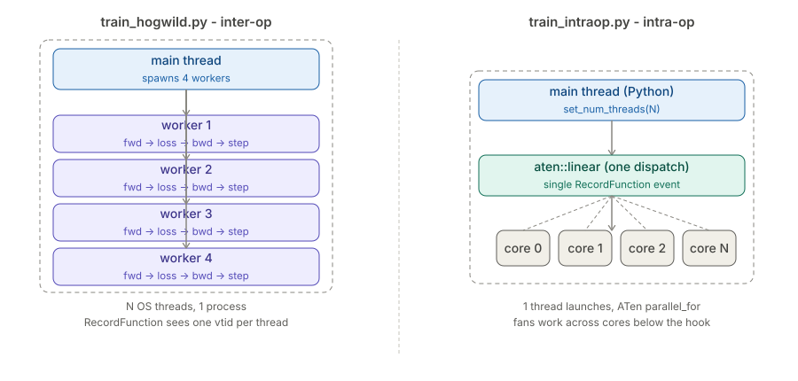
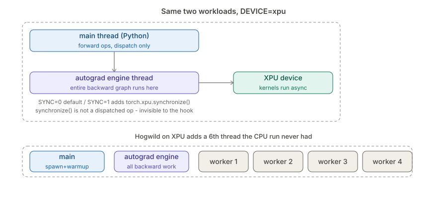
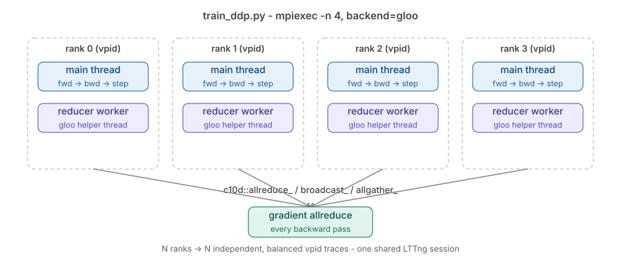
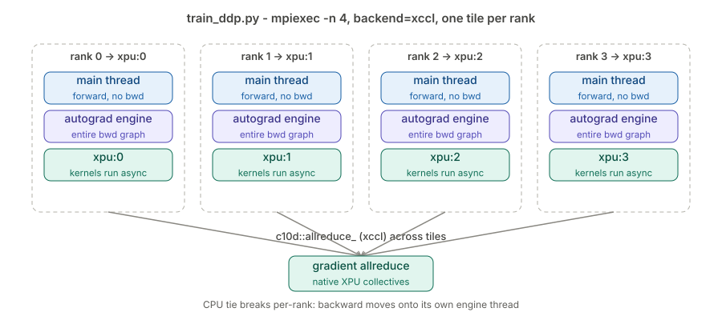

<!-- _class: title -->

# PyTorch Tracing

## Watching the ATen dispatcher with RecordFunction + LTTng

---

## Agenda

- 1. How PyTorch dispatches ops
- 2. Granularity toggles
- 3. Concurrency (CPU threads)
- 4. GPU device
- 5. MPI, CPU (DDP)
- 6. MPI, GPU (DDP on XPU)

---

# 1. How PyTorch Dispatches Ops

## 1.1 The ATen dispatcher



---

## 1.2 The RecordFunction hook — `tracer.cpp`

```cpp
std::unique_ptr<at::ObserverContext> on_entry(const at::RecordFunction& fn) {
  tracepoint(lttng_ust_pytorch, op_entry, fn.name());
  return nullptr;
}
void on_exit(const at::RecordFunction& fn, at::ObserverContext*) {
  tracepoint(lttng_ust_pytorch, op_exit, fn.name());
}
__attribute__((constructor)) void tracer_init() {
  at::addGlobalCallback(at::RecordFunctionCallback(&on_entry, &on_exit)
      .scopes({at::RecordScope::FUNCTION}));
}
```

- Built as `libtorch_tracer.so`, injected via `LD_PRELOAD` — `model.py` is unmodified
- LTTng stamps time + `vpid`/`vtid` automatically — the callback stays trivial

---

## 1.2 The RecordFunction hook — trace extract

```
op_entry aten::linear          <- composite op, outermost
  op_entry aten::t
    op_entry aten::transpose
      op_entry aten::as_strided
      op_exit  aten::as_strided
    op_exit  aten::transpose
  op_exit  aten::t
  op_entry aten::addmm         <- the real GEMM (Wx+b)
op_exit  aten::linear
op_entry aten::relu
  op_entry aten::clamp_min     <- relu's real kernel
  op_exit  aten::clamp_min
op_exit  aten::relu
```

```
[13:55:18.878163532] aurora-uan-0010 lttng_ust_pytorch:op_entry: { cpu_id = 36 }, { vpid = 27831, vtid = 27831 }, { name = "aten::linear" }
```

- 268 events captured from one `linear -> relu` forward pass, zero code changes to `model.py`
- Redispatch across dispatch keys (Autograd -> CPU) is intentionally uninstrumented — each named op fires once

---

# 2. Granularity Toggles

## 2.1 The six knobs

<div class="columns">
<div>

- **scope** (`TRACER_SCOPES`) — function only vs. +backward
- **thread** (`TRACER_THREAD`) — global vs. thread-local callback
- **depth** (`TRACER_TOPLEVEL`) — all nested ops vs. `depth==0` only
- **inputs** (`TRACER_INPUTS`) — attach `dtype[shape]@device`
- **sampling** (`TRACER_SAMPLING`) — fraction of ops sampled (global only)
- One `.so`, build once — every knob is an env var read at load time

</div>
<div>

```cpp
std::unique_ptr<at::ObserverContext> on_entry(
    const at::RecordFunction& fn) {
  const int depth = g_depth++;
  if (g_toplevel_only && depth != 0)
    return nullptr;
  const std::string args =
      g_needs_inputs ? render_inputs(fn) : "";
  tracepoint(lttng_ust_pytorch, op_entry,
             fn.name(), scope_name(fn.scope()),
             depth, args.c_str());
  return nullptr;
}

__attribute__((constructor)) void tracer_init() {
  g_toplevel_only = env_is("TRACER_TOPLEVEL", "1");
  g_needs_inputs  = env_is("TRACER_INPUTS", "1");
  if (env_is("TRACER_THREAD", "local"))
    at::addThreadLocalCallback(cb);
  else
    at::addGlobalCallback(cb);
}
```

</div>
</div>

---

## 2.1 The six knobs — what each one costs

| Toggle | Values | Effect |
|---|---|---|
| scope | `function` \| `function+backward` | reveals the 12 autograd backward nodes |
| thread | `global` \| `local` | every thread vs. registering thread only |
| depth | `0` \| `1` | all nested ops (268) vs. user-level only (92) |
| inputs | `0` \| `1` | richest + most expensive: boxes args on hot path |
| sampling | `0.0`–`1.0` | random subset, global callbacks only |

- Default recommendation: **global scope + depth==0** for a low-overhead, readable trace

---

# 3. Concurrency (CPU threads) — Step 3

## 3.1 Intro



| | Hogwild (inter-op) | Intra-op |
|---|---|---|
| Threading | N OS threads, 1 process | ATen worker pool, 1 launching thread |
| Hook sees | one `vtid` per thread | one `vtid`, work fanned below the hook |

---

## 3.2 Result — global vs. thread-local under inter-op concurrency

```
hogwild_global (addGlobalCallback):      1954 events across 5 vtid
    166  vtid 36736   <- main thread
    444  vtid 37029   <- worker 1
    448  vtid 37030   <- worker 2
    448  vtid 37031   <- worker 3
    448  vtid 37032   <- worker 4
hogwild_local  (addThreadLocalCallback):  166 events across 1 vtid
```

- A thread-local callback captured only 166/1954 events — **it missed 91% of the work**, every training thread

---

## 3.3 Result — depth counter stays correctly per-thread

```
vtid 36736: entry=83  exit=83  maxdepth=4   BALANCED
vtid 37029: entry=222 exit=222 maxdepth=6   BALANCED
vtid 37030: entry=224 exit=224 maxdepth=6   BALANCED
vtid 37031: entry=224 exit=224 maxdepth=6   BALANCED
vtid 37032: entry=224 exit=224 maxdepth=6   BALANCED
```

- The `thread_local` depth counter is correct: every thread nests independently with zero cross-thread bleed

---

## 3.4 Result — intra-op parallelism is invisible to the hook

```
intraop_global:  836 events, 1 vpid, 1 vtid — but work seen on multiple cpu_id
    aten::linear   depth=0   cpu_id=53      <- launched + bracketed on ONE thread
```

- ATen's `parallel_for` fans work across cores below the dispatch seam, so a heavily-parallel op is still just one event

---

# 4. GPU Device — Step 4

## 4.1 Intro



| Toggle | Values | Effect |
|---|---|---|
| `DEVICE` | `cpu` \| `xpu` | run ops on CPU or Aurora GPU |
| `SYNC` | `0` \| `1` | whether the workload calls `torch.xpu.synchronize()` |

---

## 4.2 Result — autograd moves to its own thread (CPU tie breaks)

```
xpu_intraop_nosync:  400 events across 2 vtid
    vtid 69957  entry=181  exit=181  maxdepth=3   <- main thread: FORWARD ops
    vtid 70050  entry=219  exit=219  maxdepth=5   <- autograd engine thread: BACKWARD
```

- On GPU, backward runs on a **dedicated engine thread** — global-vs-thread-local now matters even for single-threaded Python code

---

## 4.3 Result — multi-thread + device: thread-local misses 91.7%

```
xpu_hogwild_global (addGlobalCallback):    891 events across 6 vtid
    vtid 71880  942*  <- autograd engine thread (312 backward events)
    vtid 71892..71895  <- workers 1-4 (forward only)
xpu_hogwild_local  (addThreadLocalCallback):  74 events across 2 vtid
    -> captured 74 / 891 = 8.3%   (missed 91.7%)
```

- The device adds a 6th thread the CPU run never had; a thread-local callback misses the **entire backward graph**

---

## 4.4 Result — host-launch vs. device-exec: sync is invisible to the hook

```
diff(op-names nosync, op-names sync)  ->  (empty): SYNC adds no traced event
grep synchronize xpu_intraop_sync.txt ->  0 matches
```

- `torch.xpu.synchronize()` is not a dispatched op — the hook measures **launch structure**, not device/kernel time

---

## 4.5 Result — device shows up in the args for free

```
aten::addmm   args="Float[256]@xpu:0, Float[256,256]@xpu:0, Float[256,256]@xpu:0, scalar, scalar"
aten::copy_   args="Float[256,256]@xpu:0, Float[256,256]@cpu, scalar"   <- host->device staging visible
```

- With `TRACER_INPUTS=1`, device placement (and host↔device data staging) is visible with zero extra instrumentation

---

# 5. MPI, CPU (DDP) — Step 5

## 5.1 Intro



| Toggle | Values | Effect |
|---|---|---|
| `NRANKS` | `1` \| `4` | number of MPI ranks (processes = `vpid`s) |
| `BACKEND` | `gloo` | `torch.distributed` collective backend (CPU) |

---

## 5.2 Result — N ranks → N coherent vpids for free

```
ddp_cpu_n4_global:  5000 events (2500 entry / 2500 exit), balanced=True
    1250 events  vpid 34854   <- rank 0
    1250 events  vpid 34855   <- rank 1
    1250 events  vpid 34856   <- rank 2
    1250 events  vpid 34857   <- rank 3
```

- The tracer has no notion of rank — LTTng's `vpid` context alone separates 4 symmetric SPMD ranks

---

## 5.3 Result — every rank balanced, no cross-rank bleed

```
vtid 34854 (rank0 main):  entry=611 exit=611  maxdepth=6   BALANCED
vtid 34855 (rank1 main):  entry=611 exit=611  maxdepth=6   BALANCED
-> 8 distinct vtids across 4 vpids, ZERO overlap
```

- Each rank is fully attributable: the `thread_local` depth stack stays process-private across all 4 ranks

---

## 5.4 Result — on CPU, thread-local ties again (100%)

```
global (ddp_cpu_n4_global): 5000 events, 8 vtids
local  (ddp_cpu_n4_local):  5000 events, 8 vtids
thread-local captured 5000/5000 = 100.0%   (missed 0.0%)
```

- Backward is inline and DDP's reducer stays on the main thread, so nothing leaves the load thread's reach — on CPU

---

## 5.5 Result — DDP collectives are ordinary dispatched ops

```
   24  c10d::allreduce_                              <- gradient averaging
   32  c10d::broadcast_                               <- initial param / buffer sync
    8  c10d::allgather_
```

- Gradient synchronization dispatches through the same seam as any ATen op — no extra instrumentation needed

---

# 6. MPI, GPU (DDP on XPU) — Step 6

## 6.1 Intro



| Toggle | Values | Effect |
|---|---|---|
| `DEVICE` | `xpu` | one tile per rank |
| `BACKEND` | `xccl` | native XPU collectives |

---

## 6.2 Result — process coherence holds on device

```
ddp_xpu_n4_global:  4624 events (2312 entry / 2312 exit), balanced=True
    rank 0 -> xpu:0     rank 1 -> xpu:1
    rank 2 -> xpu:2     rank 3 -> xpu:3
```

- Four XPU ranks still produce four balanced `vpid`s, each bound to its own GPU tile

---

## 6.3 Result — CPU tie breaks per rank (autograd thread per rank)

```
per rank:  main     vtid  maxdepth=3  bwd=0    <- forward + dispatch, no backward
           autograd vtid  maxdepth=5  bwd=66   <- the whole backward graph
```

- Every rank now runs a dedicated autograd engine thread — Step 4's single-process device effect, multiplied across ranks

---

## 6.4 Result — thread-local still 100%: it's about the spawner, not the device

```
global (ddp_xpu_n4_global): 4624 events, 8 vtids
local  (ddp_xpu_n4_local):  4624 events, 8 vtids
thread-local captured 4624/4624 = 100.0%   (missed 0.0%)
```

- Torch propagates `ThreadLocalState` to the autograd thread it spawns — unlike Step 4's user-spawned Hogwild workers, which don't inherit it

---

## 6.5 Result — collectives + device placement captured for free

```
   24  c10d::allreduce_                 <- gradient averaging (xccl)
   32  c10d::broadcast_                 <- initial param / buffer sync
devices in args (ddp_xpu_n4_inputs): xpu:0=525  xpu:1=525  xpu:2=525  xpu:3=525  cpu=220
```

- Each rank's ops carry its own tile symmetrically — communication and placement visible with zero new instrumentation
