# Overview: the Kineto path end-to-end (activation, registration, collection)

**PyTorch version:** `2.10.0a0+git449b176` (full commit
`449b1768410104d3ed79d3bcfe4ba1d65c7f22c0`), Aurora `frameworks/2025.3.1`
module. All local citations are `path:line` into the installed headers at:

```
$TORCH_DIR = /opt/aurora/26.26.0/frameworks/aurora_frameworks-2025.3.1/lib/python3.12/site-packages/torch
```

CUDA-specific claims in this file are marked `[CUDA, unverified]` — no CUDA
headers/hardware exist on this system; see `docs/04-cuda-path.md`.

This doc covers the `ProfilerState::KINETO` branch only (the one
`torch.profiler.profile()` reaches) — the sibling branches (ITT/NVTX/
PRIVATEUSE1) are covered in the parent `../README.md`'s "Enabling the
profiler" section and are not repeated here.

## 1. The full layer stack

Every layer, named, with the exact symbol/struct that performs the step.

### ASCII version

```
PYTHON USER CODE
  with torch.profiler.profile(activities=[CPU, XPU]) as prof:
      model(x)
      │
      ▼
torch/profiler/profiler.py  — profile.__enter__() -> self.start()
  _KinetoProfile.prepare_trace() / start_trace()            [profiler.py:197,224]
      │  constructs torch.autograd.profiler.profile(...)
      ▼
torch/autograd/profiler.py  — profile._prepare_trace() / _start_trace()
      │  calls C++ bindings directly (NOT via that object's own __enter__)
      ▼
torch/csrc/autograd/profiler_kineto.h  (C++ bindings, torch._C._autograd)
  prepareProfiler(config, activities)                       [profiler_kineto.h:183]
  enableProfiler(config, activities, scopes)                [profiler_kineto.h:148]
      │  1. installs a RecordFunction callback
      │  2. pushes a ProfilerStateBase (thread-local or global)
      ▼
torch/csrc/profiler/orchestration/observer.h
  ProfilerStateBase::push(state)                             [observer.h:183]
  (holds ProfilerConfig{state=KINETO, activities={CPU,XPU}})  [observer.h:137-164]
      │
      ▼
ATen/record_function.h + libtorch_cpu.so (compiled, not header-only)
  at::RecordFunction wraps every ATen op (RECORD_FUNCTION macro)
  RecordFunction::runStartCallbacks() invokes the installed callback
  (confirmed via `nm -D libtorch_cpu.so`: RecordFunction::runStartCallbacks,
   at::addGlobalCallback, c10::Dispatcher::runRecordFunction)
      │  the callback body IS:
      ▼
torch/csrc/profiler/collection.h
  ThreadLocalSubqueue::begin_op(const at::RecordFunction& fn)  [collection.h:536]
      │  stores a per-thread, per-call KinetoObserverContext      [collection.h:457-474]
      │  (cheap columnar AppendOnlyList append — NOT a Result yet)
      ▼
  ... op runs ...
      │
      ▼ (on profile.stop())
  RecordQueue::getRecords(time_converter, start_ns, end_ns)     [collection.h:674-680]
      │  "NB: This is a destructive operation."
      │  calls TorchOpStorage::materialize()                     [collection.h:592]
      │  turning raw per-thread events into a tree of
      │  std::shared_ptr<Result>                                 [collection.h:377-454]
      │
      │  ALSO returns a torch::profiler::impl::kineto::ActivityTraceWrapper
      │  (the Kineto-side device-activity trace, built in parallel — see
      │  §3 "two parallel structures" below and docs/01-event-model.md)
      ▼
torch/csrc/profiler/kineto_shim.h
  kineto::prepareTrace(cpuOnly, activities, config)             [kineto_shim.h:111]
  kineto::startTrace()                                          [kineto_shim.h:119]
  kineto::stopTrace() -> ActivityTraceWrapper                   [kineto_shim.h:120]
      │  thin wrapper calling into libkineto directly
      ▼
include/kineto/libkineto.h
  libkineto::api().activityProfiler()                           [libkineto.h:89]
  (a LibkinetoApi singleton holding one ActivityProfilerInterface)
      │
      ▼
include/kineto/ActivityProfilerInterface.h
  "Synchronous API: prepareTrace -> startTrace -> stopTrace"     [ActivityProfilerInterface.h:45-47]
  prepareTrace(activityTypes, configStr)                        [ActivityProfilerInterface.h:54]
  startTrace()                                                  [ActivityProfilerInterface.h:63]
  stopTrace() -> ActivityTraceInterface                         [ActivityProfilerInterface.h:67]
  transferCpuTrace(CpuTraceBuffer)                               [ActivityProfilerInterface.h:79]
      │         (CPU-side Result events are also mirrored here as
      │          libkineto::GenericTraceActivity, for the merge)
      ▼
   ┌──────────────────────────────┬──────────────────────────────────┐
   │ CPU-side activity             │ Device-side activity              │
   │ (from RecordFunction, above)  │ (from the vendor plugin, below)   │
   └──────────────────────────────┴──────────────────────────────────┘
                                          │
                     XPU: libkineto::XpuptiActivityApi (compiled into
                          libtorch_cpu.so — confirmed via `nm -D
                          libtorch_cpu.so | c++filt`)
                          enableXpuptiActivities(activityTypes)
                              │
                              ▼
                     /opt/.../pti-gpu-0.17.0-.../include/pti/pti_view.h
                       ptiViewSetCallbacks(bufferRequested, bufferCompleted) [pti_view.h:400-402]
                       ptiViewEnable(PTI_VIEW_DEVICE_GPU_KERNEL, ...)        [pti_view.h:410]
                              │  PTI hooks Level Zero directly (zeInit, ...)
                              ▼
                     Intel Level Zero driver (GPU)
                       kernel launch, queue submit, memcpy/memset
                              │  PTI buffers these as typed records:
                              │  pti_view_record_kernel, _memory_copy, ... [pti_view.h, see docs/03]
                              ▼
                     ptiViewGetNextRecord(buffer, ...) -> pti_view_record_base* [pti_view.h:443-445]
                              │  pulled by Kineto's XpuptiActivityApi
                              ▼
                     XpuptiActivityProfilerSession::handleKernelActivity(
                         pti_view_record_kernel const*, ActivityLogger*)
                              │  translates PTI struct -> GenericTraceActivity
                              ▼
                     include/kineto/GenericTraceActivity.h  [fields: GenericTraceActivity.h:135-152]
                     ────────────────  [CUDA, unverified] ──────────────────
                     CUDA: libkineto::CuptiActivityApi (NOT compiled into
                          this XPU-only build) would call cuptiActivityEnable/
                          cuptiActivityRegisterCallbacks, receiving
                          CUpti_Activity* records from the CUDA driver's
                          CUPTI layer. See docs/04-cuda-path.md.
                     ──────────────────────────────────────────────────────
   ┌──────────────────────────────┴──────────────────────────────────┐
   │       both streams merged by libkineto into one trace            │
   └───────────────────────────────┬────────────────────────────────┘
                                    ▼
                  ActivityTraceInterface::save(path)   [ActivityTraceInterface.h]
                  -> chrome-trace JSON (traces/<run>/*.pt.trace.json)
                                    ▼
                  torch_tb_profiler TensorBoard plugin reads the file
                  (see ../../README.md Finding 4 for the live HTTP-API check)
```

### Mermaid version

```mermaid
flowchart TD
    A["Python: with torch.profiler.profile(activities=...) as prof:"] --> B

    subgraph PY["torch/profiler/profiler.py"]
        B["_KinetoProfile.prepare_trace() / start_trace()<br/>profiler.py:197,224"]
    end
    B --> C

    subgraph AG["torch/autograd/profiler.py"]
        C["profile._prepare_trace() / _start_trace()<br/>(constructed by _KinetoProfile, __enter__ never called)"]
    end
    C --> D

    subgraph CPP["torch/csrc/autograd/profiler_kineto.h"]
        D["prepareProfiler() / enableProfiler()<br/>profiler_kineto.h:148,183"]
    end
    D --> E

    subgraph OBS["torch/csrc/profiler/orchestration/observer.h"]
        E["ProfilerStateBase::push(state)<br/>observer.h:183<br/>holds ProfilerConfig{KINETO, activities}"]
    end
    E --> F

    subgraph RF["ATen/record_function.h + libtorch_cpu.so"]
        F["at::RecordFunction wraps every ATen op<br/>RecordFunction::runStartCallbacks()"]
    end
    F --> G

    subgraph COL["torch/csrc/profiler/collection.h"]
        G["ThreadLocalSubqueue::begin_op(fn)<br/>collection.h:536<br/>stores KinetoObserverContext per call"]
        G --> H["... op executes ..."]
        H --> I["RecordQueue::getRecords(...)<br/>collection.h:674-680<br/>destructive: materialize() -> Result tree"]
    end
    I --> J1
    I --> K

    subgraph RES["Result tree (CPU-side events)"]
        J1["std::shared_ptr&lt;Result&gt;<br/>collection.h:377-454<br/>ExtraFields&lt;TorchOp/Allocation/...&gt;"]
    end

    subgraph SHIM["torch/csrc/profiler/kineto_shim.h"]
        K["kineto::prepareTrace / startTrace / stopTrace<br/>kineto_shim.h:111,119,120"]
    end
    K --> L

    subgraph LK["include/kineto/libkineto.h + ActivityProfilerInterface.h"]
        L["libkineto::api().activityProfiler()<br/>libkineto.h:89<br/>prepareTrace -> startTrace -> stopTrace<br/>ActivityProfilerInterface.h:45-67"]
    end
    L --> M
    L --> N

    subgraph XPU["XPU plugin (compiled into libtorch_cpu.so)"]
        M["libkineto::XpuptiActivityApi<br/>enableXpuptiActivities()"]
        M --> M1["pti_view.h: ptiViewSetCallbacks / ptiViewEnable<br/>pti_view.h:400-410"]
        M1 --> M2["Intel Level Zero driver<br/>kernel launch, queue submit, memcpy"]
        M2 --> M3["PTI buffers pti_view_record_kernel / _memory_copy / ...<br/>pti_view.h"]
        M3 --> M4["ptiViewGetNextRecord()<br/>pti_view.h:443-445"]
        M4 --> M5["XpuptiActivityProfilerSession::handleKernelActivity(...)<br/>translates PTI struct -> GenericTraceActivity"]
    end

    subgraph CUDA["CUDA plugin [unverified, no hardware here]"]
        N["libkineto::CuptiActivityApi (not compiled into this build)<br/>cuptiActivityEnable / cuptiActivityRegisterCallbacks<br/>see docs/04-cuda-path.md"]
    end

    subgraph GTA["include/kineto/GenericTraceActivity.h"]
        O["GenericTraceActivity<br/>GenericTraceActivity.h:135-152<br/>one shape for CPU + XPU + CUDA records"]
    end
    M5 --> O
    N -.-> O
    J1 --> P
    O --> P

    subgraph MERGE["Merge + export"]
        P["ActivityTraceInterface::save(path)<br/>chrome-trace JSON<br/>traces/&lt;run&gt;/*.pt.trace.json"]
        P --> Q["torch_tb_profiler TensorBoard plugin<br/>see ../../README.md Finding 4"]
    end
```



## 2. Activation: which function actually flips the switch

Already documented in detail in `../README.md` ("Enabling the profiler: one
call, one `ProfilerState`") — summary of the part relevant here: a plain
`with torch.profiler.profile(activities=[...]):` resolves through an
`action_map` state table to call `prepare_trace()` then `start_trace()` on
the **outer** `_KinetoProfile` object (`torch/profiler/profiler.py`), which
constructs a `torch.autograd.profiler.profile` object and calls its
`_prepare_trace()`/`_start_trace()` methods *directly* (not via `__enter__`).
Those call the C++ bindings:

```cpp
// torch/csrc/autograd/profiler_kineto.h:148 and :183
TORCH_API void enableProfiler(
    const torch::profiler::impl::ProfilerConfig& config,
    const std::set<torch::profiler::impl::ActivityType>& activities,
    const std::unordered_set<at::RecordScope>& scopes = {});

TORCH_API void prepareProfiler(
    const torch::profiler::impl::ProfilerConfig& config,
    const std::set<torch::profiler::impl::ActivityType>& activities);
```

These two free functions are the actual activation point: `prepareProfiler`
allocates the `RecordQueue` and warms up tracing structures;
`enableProfiler` pushes the `ProfilerStateBase` (next section) and calls
`kineto::prepareTrace`/`startTrace` under the hood.

## 3. RecordFunction callback registration

`ProfilerStateBase` is the thread-local-or-global holder that makes
RecordFunction actually invoke profiler code:

```cpp
// torch/csrc/profiler/orchestration/observer.h:168-211
struct TORCH_API ProfilerStateBase : public c10::MemoryReportingInfoBase {
  explicit ProfilerStateBase(ProfilerConfig config);
  static ProfilerStateBase* get(bool global);
  static void push(std::shared_ptr<ProfilerStateBase>&& state);     // line 183
  static std::shared_ptr<ProfilerStateBase> pop(bool global);
  const ProfilerConfig& config() const { return config_; }
  void setCallbackHandle(at::CallbackHandle handle);
  void removeCallback();
  bool memoryProfilingEnabled() const override {
    return config_.profile_memory;
  }
  virtual ActiveProfilerType profilerType() = 0;
 protected:
  ProfilerConfig config_ = ProfilerConfig(ProfilerState::Disabled);
  at::CallbackHandle handle_ = 0;
};
```

`setCallbackHandle` stores the handle returned by registering a
`RecordFunctionCallback` with RecordFunction's own registry — the compiled
(not header-only) implementation of `enableProfiler` calls
`at::addThreadLocalCallback`/`at::addGlobalCallback` (both declared in
`ATen/record_function.h`, already cited in `../README.md`) with a callback
whose **start** body is `ThreadLocalSubqueue::begin_op` and whose **end**
body finalizes the op's timing/metadata into that same per-thread
`KinetoObserverContext`. Symbol-level confirmation that this registration
and dispatch path is compiled into `libtorch_cpu.so`:

```
$ nm -D libtorch_cpu.so | c++filt | grep -i "RecordFunction\|addGlobalCallback\|runRecordFunction"
at::RecordFunction::runStartCallbacks()
at::RecordFunction::end()
at::RecordFunction::before(...)
at::addGlobalCallback(...)
c10::Dispatcher::runRecordFunction(...)
```

`enableRecordFunction(bool)` (also present in this symbol list) is the
global on/off switch RecordFunction itself checks before doing any of this
work — when no profiler is active, the per-op overhead is a single boolean
check, not a callback invocation.

## 4. Trace collection: the two-buffer model

This is the part worth internalizing before reading `docs/01-event-model.md`:
**collection produces two separate structures that only get stitched
together at the very end.**

1. **CPU-side `Result` tree** — built per-thread in
   `ThreadLocalSubqueue` (`collection.h:532-661`), materialized into
   `std::shared_ptr<Result>` nodes (`collection.h:377-454`) by
   `RecordQueue::getRecords()` (`collection.h:663-680`). This tree knows
   about every ATen op, Python call, allocation, etc. that RecordFunction
   observed — entirely CPU-side bookkeeping, independent of which device
   activities were requested.
2. **Kineto device-activity trace** — built by whichever vendor plugin was
   enabled (`XpuptiActivityApi` for XPU, `[CUDA, unverified] CuptiActivityApi`
   for CUDA), living as `libkineto::GenericTraceActivity` records inside
   Kineto's own buffers, independent of PyTorch's `Result` tree.

`RecordQueue::getRecords()`'s actual return type makes this split explicit:

```cpp
// torch/csrc/profiler/collection.h:663-680
class TORCH_API RecordQueue {
 public:
  RecordQueue(ProfilerConfig config, std::set<ActivityType> activities);
  ThreadLocalSubqueue* getSubqueue();
  void stop();
  void restart();

  // NB: This is a destructive operation.
  std::pair<
      std::vector<std::shared_ptr<Result>>,
      std::unique_ptr<torch::profiler::impl::kineto::ActivityTraceWrapper>>
  getRecords(
      std::function<c10::time_t(c10::approx_time_t)> time_converter,
      uint64_t start_time_ns,
      uint64_t end_time_ns);
  ...
};
```

The two halves of that `std::pair` are exactly the two buffers above. They
are reconciled by correlation id — `ExtraFields<EventType::Kineto>`
(`collection.h:357-374`) is the bridge type that lets a `Result` node
reference a `libkineto::GenericTraceActivity` by `correlation_id_`:

```cpp
// torch/csrc/profiler/collection.h:357-374
template <>
struct ExtraFields<EventType::Kineto> {
  // Mirrors `libkineto::GenericTraceActivity::Flow`. This information is
  // used during post processing to properly embed Kineto events into the
  // broader profiler tree structure. End users are not generally expected
  // to use these fields directly, but they are available for debugging.
  struct Flow {
    uint32_t id{0};
    uint32_t type{0};
    uint32_t start{0};
  };

  std::string name_;
  int64_t duration_ns_{0};
  uint64_t correlation_id_{0};
  libkineto::ActivityType activity_type_;
  Flow flow;
  std::weak_ptr<Result> linked_activity_;
  std::string metadata_json_;
};
```

This is why Finding 3 in `../README.md` sees both `cpu_op` events (from the
`Result` tree) and `kernel`/`xpu_runtime` events (from the Kineto device
trace) in the same exported JSON, connected by `args.correlation` /
`EXTERNAL_CORRELATION` ids rather than nested inside one shared struct.
`docs/01-event-model.md` goes deeper into exactly which `EventType` maps to
which exported category, and `docs/02-cpu-path.md`/`docs/03-xpu-path.md`
annotate real recorded JSON events against these structs field-by-field.

## What's next

- `docs/01-event-model.md` — event classification (`EventType`), where
  events live before export, whether the format differs per activity.
- `docs/02-cpu-path.md` — a real `aten::addmm` op and a real memory
  allocation event from `traces/cpu/*.pt.trace.json`, annotated against
  `TorchOpBasicFields`/`ExtraFields<TorchOp>`/`ExtraFields<Allocation>`.
- `docs/03-xpu-path.md` — a real `gemm_kernel` event from
  `traces/xpu/*.pt.trace.json`, annotated against `pti_view_record_kernel`.
- `docs/04-cuda-path.md` — the CUDA analogue, from upstream source only,
  explicitly unverified.
