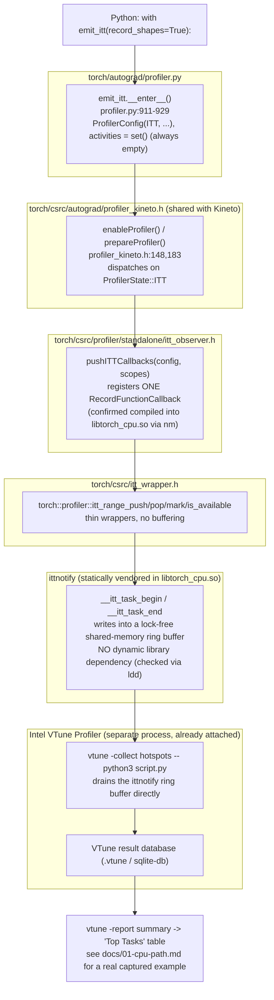

# Overview: the ITT path (`torch.autograd.profiler.emit_itt`)

**PyTorch version:** `2.10.0a0+git449b176` (full commit
`449b1768410104d3ed79d3bcfe4ba1d65c7f22c0`), Aurora `frameworks/2025.3.1`
module. All local citations are `path:line` into:

```
$TORCH_DIR = /opt/aurora/26.26.0/frameworks/aurora_frameworks-2025.3.1/lib/python3.12/site-packages/torch
```

This doc covers the `ProfilerState::ITT` branch — the sibling of `KINETO`
documented in depth in `../../kineto-deep-dive/`. Read that first for the
shared activation entry point (`_enable_profiler`/`_prepare_profiler`,
`ProfilerStateBase`); this doc only covers what's *different* about ITT.

## 1. The layer stack — much shorter than Kineto's

ITT has no buffer, no plugin, no device driver hand-off. It is a **marker
API**: every RecordFunction-observed op pushes/pops a named range into a
library that a separate, already-attached collector (VTune) is watching.
Nothing is buffered or exported by PyTorch itself.

### ASCII version

```
PYTHON USER CODE
  with torch.autograd.profiler.emit_itt(record_shapes=True):
      model(x); loss.backward()
      │
      ▼
torch/autograd/profiler.py — emit_itt class               [profiler.py:869-937]
  __enter__():                                              [profiler.py:911-929]
    _run_on_profiler_start()
    _enable_profiler(
        ProfilerConfig(ProfilerState.ITT, record_shapes, ...),
        set()                         <- EMPTY activity set, always
    )
      │  no "which device" decision exists at this layer — compare to
      │  Kineto's kineto_activities set, which IS populated per-activity
      ▼
torch/csrc/autograd/profiler_kineto.h  (same bindings Kineto also calls)
  enableProfiler(config, activities, scopes)                 [profiler_kineto.h:148]
  prepareProfiler(config, activities)                        [profiler_kineto.h:183]
      │  dispatches on config.state == ProfilerState::ITT
      ▼
torch/csrc/profiler/standalone/itt_observer.h
  pushITTCallbacks(config, scopes)                            [itt_observer.h:6-8]
      │  registers ONE at::RecordFunctionCallback whose start/end lambdas
      │  call torch::profiler::itt_range_push()/itt_range_pop() directly —
      │  confirmed compiled into libtorch_cpu.so:
      │    torch::profiler::impl::pushITTCallbacks(...)
      │    pushITTCallbacks(...)::{lambda(RecordFunction const&, ...)}::_FUN
      │  (symbols found via `nm libtorch_cpu.so | c++filt`, local/static —
      │   not exported, unlike Kineto's dynamic-linkage plugin symbols)
      ▼
torch/csrc/itt_wrapper.h
  torch::profiler::itt_range_push(const char* msg)            [itt_wrapper.h:8]
  torch::profiler::itt_range_pop()                            [itt_wrapper.h:9]
  torch::profiler::itt_is_available()                         [itt_wrapper.h:7]
  torch::profiler::itt_mark(const char* msg)                  [itt_wrapper.h:10]
      │  thin wrappers over the vendored Intel ittnotify API
      ▼
ittnotify (statically vendored into libtorch_cpu.so — confirmed via
`nm -D libtorch_cpu.so`: __itt_domain_create_ptr__3_0, __itt_task_begin,
__itt_task_end, etc.; `ldd` shows NO dynamic ITT library dependency)
      │  __itt_task_begin()/__itt_task_end() write into a lock-free
      │  shared-memory ring buffer ITT's own runtime maintains
      ▼
Intel VTune Profiler (a SEPARATE PROCESS, already attached via
`vtune -collect hotspots -- python3 script.py`)
      │  VTune's collector drains the ittnotify ring buffer directly —
      │  PyTorch/ittnotify never write a trace file themselves
      ▼
VTune result database (.vtune / sqlite-db) -> `vtune -report summary`
"Top Tasks" table (see docs/01-cpu-path.md for a real captured example)
```

Contrast with Kineto (`../../kineto-deep-dive/docs/00-overview.md`): no
`CpuTraceBuffer`, no `ActivityProfilerInterface`, no `libkineto::api()`, no
vendor device-activity plugin, no chrome-trace JSON. ITT's entire "export"
step is "a separate process was already watching."

### Mermaid version



## 2. Activation — the shared entry point, ITT's branch

`emit_itt.__enter__()` (`profiler.py:911-929`) calls the exact same
`_enable_profiler`/`_prepare_profiler` C++ bindings that `torch.profiler.profile()`
calls (see `../../kineto-deep-dive/docs/00-overview.md` §2) — but unlike
`_KinetoProfile`, `emit_itt` calls them **directly on itself**, with no
intermediate `profile`/`_KinetoProfile` layer at all:

```python
# torch/autograd/profiler.py:911-929
def __enter__(self):
    if not self.enabled:
        return
    if self.entered:
        raise RuntimeError("ITT annotation context manager is not reentrant")
    self.entered = True
    _run_on_profiler_start()
    _enable_profiler(
        ProfilerConfig(
            ProfilerState.ITT,
            self.record_shapes,
            False,
            False,
            False,
            False,
            _ExperimentalConfig(),
        ),
        set(),
    )
    return self
```

Note the final argument to `_enable_profiler` — an unconditional, empty
`set()` where Kineto would pass its `kineto_activities` set
(`{ProfilerActivity.CPU}`, `{CPU, XPU}`, etc.). This is the single line
that proves there is no "which device" decision anywhere in ITT's
activation path — there is no activity set to populate in the first place.

## 3. RecordFunction registration — one callback, not a buffer

`enableProfiler`'s compiled implementation dispatches on `config.state` and,
for `ProfilerState::ITT`, calls `pushITTCallbacks`
(`torch/csrc/profiler/standalone/itt_observer.h:6-8`):

```cpp
// torch/csrc/profiler/standalone/itt_observer.h:4-10
namespace torch::profiler::impl {
void pushITTCallbacks(
    const ProfilerConfig& config,
    const std::unordered_set<at::RecordScope>& scopes);
}
```

Symbol-level confirmation of what this function actually does, found via
`nm libtorch_cpu.so | c++filt` (these are local/static `t` symbols, not
exported `T` symbols — ITT's callback is compiled inline, unlike Kineto's
dynamically-linked plugin classes):

```
torch::profiler::impl::pushITTCallbacks(ProfilerConfig const&, unordered_set<RecordScope> const&)
torch::profiler::impl::pushITTCallbacks(...)::{lambda(RecordFunction const&, ObserverContext*)#1}::_FUN(...)
```

That lambda is the callback body `at::addThreadLocalCallback`/
`at::addGlobalCallback` installs (same registration mechanism documented
for Kineto in `../../kineto-deep-dive/docs/00-overview.md` §3) — its start
handler calls `torch::profiler::itt_range_push(fn.name())`, its end handler
calls `torch::profiler::itt_range_pop()`. There is no
`ThreadLocalSubqueue`/`KinetoObserverContext`/`Result` tree involved at
all — ITT's callback talks directly to the marker API with nothing staged
in between.

## 4. The wrapper functions and the vendored `ittnotify` library

```cpp
// torch/csrc/itt_wrapper.h
namespace torch::profiler {
TORCH_API bool itt_is_available();
TORCH_API void itt_range_push(const char* msg);
TORCH_API void itt_range_pop();
TORCH_API void itt_mark(const char* msg);
}
```

These four functions (exported, `T` symbols — confirmed via
`nm -D libtorch_cpu.so | c++filt`) are thin wrappers over Intel's
**ittnotify** API, which PyTorch vendors and statically links in rather
than depending on dynamically:

```
$ nm -D libtorch_cpu.so | c++filt | grep -i itt | head
D __itt_api_version_ptr__3_0
D __itt_domain_create_ptr__3_0
T __itt_fini_ittlib
T __itt_get_collection_state
D __itt_task_begin_ptr__3_0  (and ~80 more __itt_* function-pointer slots)

$ ldd libtorch_cpu.so | grep -i itt
(no output — no dynamic ITT library dependency)
```

The `D` (data) symbols are ittnotify's lazy-binding function-pointer table —
a standard pattern for its "collector may or may not be attached" design:
calling `__itt_task_begin` before any collector attaches is a cheap no-op
through an uninitialized function pointer, and `is_available()`
(`torch/profiler/itt.py:31-35`, wrapping `torch._C._itt.is_available()`)
reports whether that pointer has actually been bound to a real collector.
This is exactly why `itt_is_available()` returned `True` on this system
with no special setup (confirmed live, §5) — the ittnotify library itself
is always present (statically linked), "available" just means a collector
has successfully attached to it, which VTune does the moment it launches
the process.

## 5. Live confirmation on this system

```
$ source env.sh && python3 -c "
import torch.profiler.itt as itt
print(itt.is_available())
"
True
```

```
$ python3 -c "
import torch
from torch.autograd.profiler import emit_itt
from model import build
model, x = build()
with emit_itt(record_shapes=True):
    output = model(x)
    loss = output.sum()
    loss.backward()
print('ran without error')
"
ran without error
```

Both ran on the Aurora **login node** — no compute-node reservation
needed. This is a direct consequence of §1-4: ITT never touches a device
activity collector (no PTI, no Level-Zero `zeInit()`), so it has nothing
analogous to Kineto's login-node crash (`../../README.md` Finding 0: even
`torch.profiler.profile(activities=[CPU])` crashes there with
`PTI_ERROR_INTERNAL`/`Unable to initialize Level Zero driver(s)`).

## What's next

- `docs/01-cpu-path.md` — a real VTune result from this system, with named
  ITT tasks (`aten::addmm`, `aten::linear`, etc.) and their counts/timings,
  annotated against what produced them.
- `docs/02-no-device-support.md` — the explicit, evidence-backed answer on
  CUDA/XPU-device support (there is none, by design), backed by a live run
  on an actual XPU compute node, not just the symbol/source evidence above.
