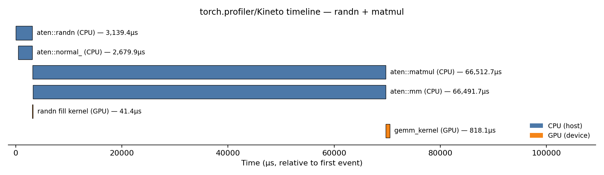
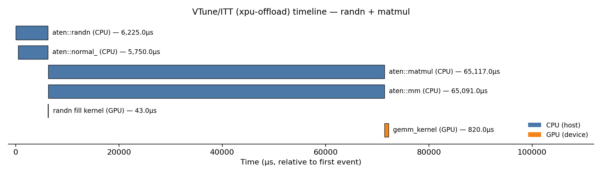
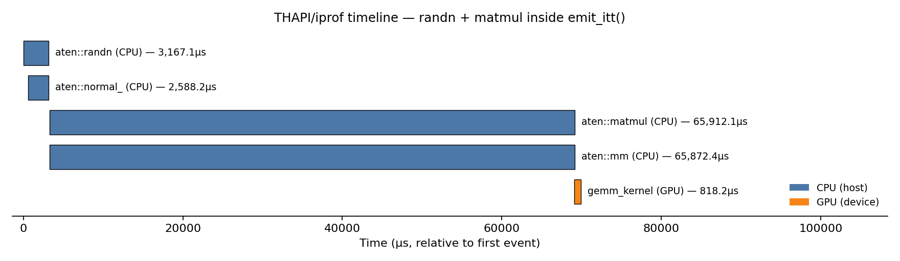

<a href="">

</a>

# Tracing AI/ML Workloads: torch.profiler/Kineto, VTune/ITT, THAPI/iprof - Three Different Flavors

1. Three Tools, Three Tracing Approaches
2. THAPI/iprof: What Problem Does It Solve?
3. THAPI/iprof Pipeline: Intercept (LD_PRELOAD) → Collect (LTTng) → Analyze (Babeltrace2)
4. THAPI/iprof: System Architecture
5. Comparing the Three: Similarities and Differences

---

### 1. Three Tools, Three Tracing Approaches

__torch.profiler/Kineto__

```bash
python model.py
```

```python
# model.py
import torch
from torch.profiler import profile, ProfilerActivity

with profile(activities=[ProfilerActivity.CPU, ProfilerActivity.XPU]) as prof:
    x = torch.randn(2048, 2048, device="xpu")
    y = torch.matmul(x, x)
torch.xpu.synchronize()
```

```bash
-------------------------------------------------------  ------------  ------------  ------------  ------------  ------------  ------------  ------------  ------------  ------------  ------------  
                                                   Name    Self CPU %      Self CPU   CPU total %     CPU total  CPU time avg      Self XPU    Self XPU %     XPU total  XPU time avg    # of Calls  
-------------------------------------------------------  ------------  ------------  ------------  ------------  ------------  ------------  ------------  ------------  ------------  ------------  
                                               aten::mm        94.47%      65.799ms        95.46%      66.492ms      66.492ms     829.920us        95.24%     829.920us     829.920us             1  
                                            gemm_kernel         0.00%       0.000us         0.00%       0.000us       0.000us     818.080us        93.89%     818.080us     818.080us             1  
                                          aten::normal_         2.81%       1.954ms         3.85%       2.680ms       2.680ms      41.440us         4.76%      41.440us      41.440us             1  
at::native::xpu::DistributionElementwiseKernelFuncto...         0.00%       0.000us         0.00%       0.000us       0.000us      41.440us         4.76%      41.440us      41.440us             1  
                                        Memset (DEVICE)         0.00%       0.000us         0.00%       0.000us       0.000us      11.840us         1.36%      11.840us      11.840us             1  
                                            aten::randn         0.11%      75.932us         4.51%       3.139ms       3.139ms       0.000us         0.00%      41.440us      41.440us             1  
                                            aten::empty         0.14%      94.220us         0.56%     391.410us     195.705us       0.000us         0.00%       0.000us       0.000us             2  
                                       urUSMDeviceAlloc         1.00%     696.193us         1.00%     696.193us     232.064us       0.000us         0.00%       0.000us       0.000us             3  
                                  urEnqueueKernelLaunch         1.10%     764.716us         1.10%     764.716us     382.358us       0.000us         0.00%       0.000us       0.000us             2  
                                           aten::matmul         0.03%      20.976us        95.49%      66.513ms      66.513ms       0.000us         0.00%     829.920us     829.920us             1  
                                          aten::resize_         0.00%       2.680us         0.00%       2.680us       2.680us       0.000us         0.00%       0.000us       0.000us             1  
                                       urEnqueueUSMFill         0.35%     244.582us         0.35%     244.582us     244.582us       0.000us         0.00%       0.000us       0.000us             1  
-------------------------------------------------------  ------------  ------------  ------------  ------------  ------------  ------------  ------------  ------------  ------------  ------------  
Self CPU time total: 69.652ms
Self XPU time total: 871.360us
```



🔗 [Explore this trace in Perfetto](https://ui.perfetto.dev/#!/?url=https://raw.githubusercontent.com/DonAurelio/notes/main/slides/2026_TracingIAML/kineto_timeline.json)

__VTune/ITT__

```bash
vtune -collect xpu-offload -- python model.py
```

```python
import torch
with torch.autograd.profiler.emit_itt():
    x = torch.randn(2048, 2048, device="xpu")
    y = torch.matmul(x, x)
torch.xpu.synchronize()
```

```bash 
Hottest Host Tasks
Host Task       Task Time  % of Elapsed Time(%)  Task Count
--------------  ---------  --------------------  ----------
aten::matmul       0.065s                  0.0%           1
aten::mm           0.065s                  0.0%           1
aten::randn        0.006s                  0.0%           1
aten::normal_      0.006s                  0.0%           1
zeModuleCreate     0.001s                  0.0%          14
[Others]           0.005s                  0.0%         101

Hottest GPU Computing Tasks
Computing Task                                                                                                                                                                             Total Time  Instance Count
-----------------------------------------------------------------------------------------------------------------------------------------------------------------------------------------  ----------  --------------
gemm_kernel                                                                                                                                                                                    0.001s               1
DistributionElementwiseKernelFunctor<float, float, (int)4, at::native::templates::xpu::Normal4DistributionFunctor, at::native::templates::xpu::NormalTransformFunctor<float, float>, int>      0.000s               1
```



> Note: VTune's result format is proprietary (not Perfetto-compatible), so there is no "explore in Perfetto" link here — view the native timeline with `vtune-gui`/`vtune-backend` instead (see this folder's README).

__THAPI/iprof__

```bash
iprof -- python model.py
```
```python
# model.py
import torch 
x = torch.randn(2048, 2048, device="xpu")
y = torch.matmul(x, x)
torch.xpu.synchronize()
```

```bash
BACKEND_PYTORCH | 1 Hostnames | 1 Processes | 1 Threads | 

                     Name |     Time | Time(%) | Calls |  Average |     Min |      Max |         
             aten::matmul |  66.20ms |  46.00% |     1 |  66.20ms | 66.20ms |  66.20ms |         
                 aten::mm |  66.17ms |  45.98% |     1 |  66.17ms | 66.17ms |  66.17ms |         
              aten::randn |   5.81ms |   4.04% |     1 |   5.81ms |  5.81ms |   5.81ms |         
            aten::normal_ |   5.41ms |   3.76% |     1 |   5.41ms |  5.41ms |   5.41ms |         
aten::empty.memory_format | 325.68us |   0.23% |     2 | 162.84us |  8.17us | 317.51us |         
            aten::resize_ |   2.90us |   0.00% |     1 |   2.90us |  2.90us |   2.90us |         
                    Total | 143.92ms | 100.00% |     7 |                                         

BACKEND_ITT | 1 Hostnames | 1 Processes | 1 Threads | 

                           Name |     Time | Time(%) | Calls |  Average |      Min |      Max |         
dnnl::primitive::execute:matmul | 378.14us | 100.00% |     1 | 378.14us | 378.14us | 378.14us |         
                          Total | 378.14us | 100.00% |     1 |                                          

BACKEND_OPENCL,BACKEND_ZE | 1 Hostnames | 1 Processes | 1 Threads | 

                               Name |     Time | Time(%) | Calls |  Average |      Min |      Max |         
        zeContextMakeMemoryResident |   7.06ms |  38.03% |   324 |  21.79us |   5.73us | 326.69us |         
              zeDeviceCanAccessPeer |   3.12ms |  16.82% |   132 |  23.65us |    177ns |  67.39us |         
                          zeMemFree |   2.55ms |  13.75% |    74 |  34.51us |   8.70us | 134.10us |         
                     zeModuleCreate |   1.23ms |   6.60% |    14 |  87.60us |  36.00us | 501.33us |         
       zeCommandListCreateImmediate |   1.10ms |   5.93% |     2 | 550.45us | 231.55us | 869.35us |         
                   zeMemAllocShared | 924.03us |   4.98% |    48 |  19.25us |  15.29us |  40.08us |         
             zeEventHostSynchronize | 666.14us |   3.59% |     1 | 666.14us | 666.14us | 666.14us |         
    zeCommandListAppendLaunchKernel | 319.45us |   1.72% |     2 | 159.72us |  22.94us | 296.51us |         
                    clGetDeviceInfo | 231.75us |   1.25% |  1117 | 207.48ns |    143ns |   2.13us |         
      zeCommandListAppendMemoryFill | 224.69us |   1.21% |     1 | 224.69us | 224.69us | 224.69us |         
zeDriverGetExtensionFunctionAddress | 223.94us |   1.21% |    11 |  20.36us |    320ns | 206.62us |         
                   zeMemAllocDevice | 195.86us |   1.05% |    27 |   7.25us |   4.97us |  17.90us |         
                     zeMemAllocHost | 159.39us |   0.86% |     2 |  79.69us |  48.94us | 110.44us |         
              zeDeviceGetRootDevice | 156.95us |   0.85% |   972 | 161.47ns |    121ns |   2.93us |         
                     clGetDeviceIDs | 115.51us |   0.62% |     4 |  28.88us |   1.74us |  99.47us |         
                    zeModuleDestroy |  65.38us |   0.35% |    13 |   5.03us |   1.33us |  44.35us |         
                  clGetPlatformInfo |  57.03us |   0.31% |   128 | 445.52ns |    148ns |   4.62us |         
                     zeKernelCreate |  50.52us |   0.27% |    14 |   3.61us |   1.65us |  10.07us |         
                      zeInitDrivers |  28.87us |   0.16% |     7 |   4.12us |    427ns |  25.74us |         
                  zeEventPoolCreate |  20.92us |   0.11% |     1 |  20.92us |  20.92us |  20.92us |         
                      zeEventCreate |  14.25us |   0.08% |     3 |   4.75us |   1.14us |   9.80us |         
              zeDeviceGetSubDevices |  10.96us |   0.06% |    38 | 288.55ns |    141ns |    999ns |         
                    zeKernelDestroy |  10.13us |   0.05% |    13 | 779.54ns |    397ns |   3.73us |         
                             zeInit |   9.17us |   0.05% |     7 |   1.31us |    171ns |   6.91us |         
          zeKernelSetIndirectAccess |   4.63us |   0.02% |    14 | 330.86ns |    208ns |    545ns |         
                    zeContextCreate |   4.26us |   0.02% |     1 |   4.26us |   4.26us |   4.26us |         
                   clGetPlatformIDs |   3.57us |   0.02% |     2 |   1.79us |    399ns |   3.17us |         
                        zeDeviceGet |   2.85us |   0.02% |    10 | 285.40ns |    184ns |    718ns |         
                        zeDriverGet |   2.12us |   0.01% |     8 | 265.12ns |    150ns |    670ns |         
               zeKernelSetGroupSize |   1.62us |   0.01% |     2 | 809.00ns |    776ns |    842ns |         
              zeDriverGetApiVersion |    353ns |   0.00% |     1 | 353.00ns |    353ns |    353ns |         
                              Total |  18.57ms | 100.00% |  2993 |                                          

Device profiling | 1 Hostnames | 1 Processes | 1 Threads | 1 Devices | 1 Subdevices | 

                                                                            Name |     Time | Time(%) | Calls |  Average |      Min |      Max |         
                                                                     gemm_kernel | 818.72us |  93.87% |     1 | 818.72us | 818.72us | 818.72us |         
at::native::xpu::DistributionElementw[...]alTransformFunctor<float, float>, int> |  41.60us |   4.77% |     1 |  41.60us |  41.60us |  41.60us |         
                                                zeCommandListAppendMemoryFill(D) |  11.84us |   1.36% |     1 |  11.84us |  11.84us |  11.84us |         
                                                                           Total | 872.16us | 100.00% |     3 |                                          

Explicit memory traffic (BACKEND_ZE) | 1 Hostnames | 1 Processes | 1 Threads | 

                            Name |     Byte | Byte(%) | Calls | Average |     Min |     Max |         
     zeContextMakeMemoryResident | 578.81MB |  97.53% |   324 |  1.79MB |      1B | 16.78MB |         
zeCommandListAppendMemoryFill(D) |  14.68MB |   2.47% |     1 | 14.68MB | 14.68MB | 14.68MB |         
                           Total | 593.49MB | 100.00% |   325 |                                       


```



🔗 [Explore this trace in Perfetto](https://ui.perfetto.dev/#!/?url=https://raw.githubusercontent.com/DonAurelio/notes/main/slides/2026_TracingIAML/iprof_timeline.pftrace)

---

