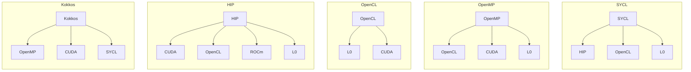
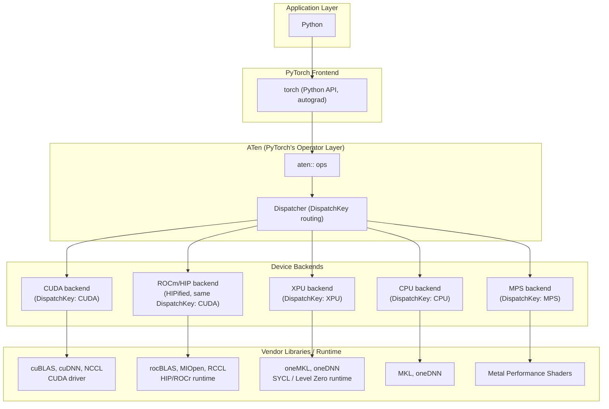
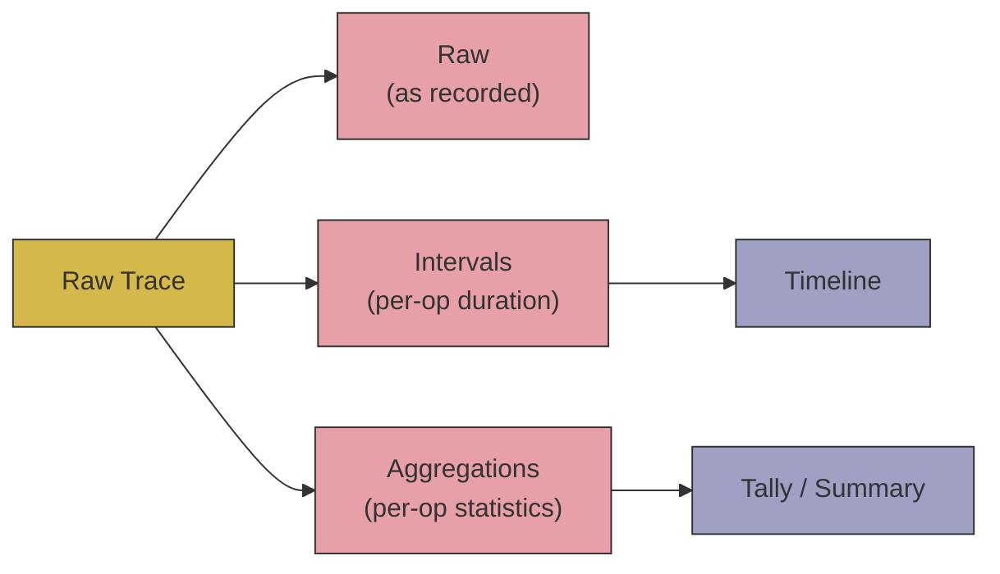
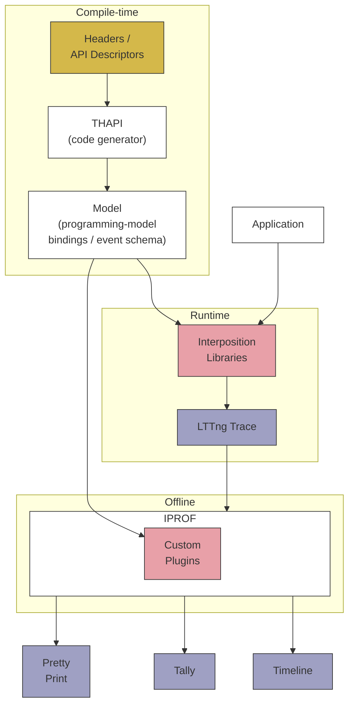

<a href="">

</a>

# Tracing AI/ML Workloads: torch.profiler/Kineto, VTune/ITT, THAPI/iprof - Three Different Flavors

1. Three Tools, Three Tracing Approaches
2. THAPI/iprof: Motivation
3. THAPI/iprof: Design Decisions
4. THAPI/iprof: Architecture
5. When to Reach for THAPI/iprof

---

### 1. Three Tools, Three Tracing Approaches

The same minimal workload — `randn` + `matmul` on an XPU tensor — traced three
different ways. Notice what each tool asks of the script, and what it hands
back.

__torch.profiler/Kineto__

```bash
python model.py
```

```python
# model.py
import torch
from torch.profiler import profile, ProfilerActivity

with profile(activities=[ProfilerActivity.CPU, ProfilerActivity.XPU]) as prof:
    x = torch.randn(2048, 2048, device="xpu")
    y = torch.matmul(x, x)
torch.xpu.synchronize()
```

```text
-------------------------------------------------------  ------------  ------------  ------------  ------------  ------------  ------------  ------------  ------------  ------------  ------------  
                                                   Name    Self CPU %      Self CPU   CPU total %     CPU total  CPU time avg      Self XPU    Self XPU %     XPU total  XPU time avg    # of Calls  
-------------------------------------------------------  ------------  ------------  ------------  ------------  ------------  ------------  ------------  ------------  ------------  ------------  
                                               aten::mm        94.47%      65.799ms        95.46%      66.492ms      66.492ms     829.920us        95.24%     829.920us     829.920us             1  
                                            gemm_kernel         0.00%       0.000us         0.00%       0.000us       0.000us     818.080us        93.89%     818.080us     818.080us             1  
                                          aten::normal_         2.81%       1.954ms         3.85%       2.680ms       2.680ms      41.440us         4.76%      41.440us      41.440us             1  
at::native::xpu::DistributionElementwiseKernelFuncto...         0.00%       0.000us         0.00%       0.000us       0.000us      41.440us         4.76%      41.440us      41.440us             1  
                                        Memset (DEVICE)         0.00%       0.000us         0.00%       0.000us       0.000us      11.840us         1.36%      11.840us      11.840us             1  
                                            aten::randn         0.11%      75.932us         4.51%       3.139ms       3.139ms       0.000us         0.00%      41.440us      41.440us             1  
                                            aten::empty         0.14%      94.220us         0.56%     391.410us     195.705us       0.000us         0.00%       0.000us       0.000us             2  
                                       urUSMDeviceAlloc         1.00%     696.193us         1.00%     696.193us     232.064us       0.000us         0.00%       0.000us       0.000us             3  
                                  urEnqueueKernelLaunch         1.10%     764.716us         1.10%     764.716us     382.358us       0.000us         0.00%       0.000us       0.000us             2  
                                           aten::matmul         0.03%      20.976us        95.49%      66.513ms      66.513ms       0.000us         0.00%     829.920us     829.920us             1  
                                          aten::resize_         0.00%       2.680us         0.00%       2.680us       2.680us       0.000us         0.00%       0.000us       0.000us             1  
                                       urEnqueueUSMFill         0.35%     244.582us         0.35%     244.582us     244.582us       0.000us         0.00%       0.000us       0.000us             1  
-------------------------------------------------------  ------------  ------------  ------------  ------------  ------------  ------------  ------------  ------------  ------------  ------------  
Self CPU time total: 69.652ms
Self XPU time total: 871.360us
```


🔗 [Explore this trace in Perfetto](https://ui.perfetto.dev/#!/?url=https://raw.githubusercontent.com/DonAurelio/notes/main/slides/2026_TracingIAML/kineto_timeline.json)

__VTune/ITT__

```bash
vtune -collect xpu-offload -- python model.py
```

```python
import torch
with torch.autograd.profiler.emit_itt():
    x = torch.randn(2048, 2048, device="xpu")
    y = torch.matmul(x, x)
torch.xpu.synchronize()
```

```text
Hottest Host Tasks
Host Task       Task Time  % of Elapsed Time(%)  Task Count
--------------  ---------  --------------------  ----------
aten::matmul       0.065s                  0.0%           1
aten::mm           0.065s                  0.0%           1
aten::randn        0.006s                  0.0%           1
aten::normal_      0.006s                  0.0%           1
zeModuleCreate     0.001s                  0.0%          14
[Others]           0.005s                  0.0%         101

Hottest GPU Computing Tasks
Computing Task                                                                                                                                                                             Total Time  Instance Count
-----------------------------------------------------------------------------------------------------------------------------------------------------------------------------------------  ----------  --------------
gemm_kernel                                                                                                                                                                                    0.001s               1
DistributionElementwiseKernelFunctor<float, float, (int)4, at::native::templates::xpu::Normal4DistributionFunctor, at::native::templates::xpu::NormalTransformFunctor<float, float>, int>      0.000s               1
```


> Note: VTune's result format is proprietary (not Perfetto-compatible) — view the native timeline with `vtune-gui`/`vtune-backend` instead.

__THAPI/iprof__

```bash
iprof -- python model.py
```

```python
# model.py
import torch 
x = torch.randn(2048, 2048, device="xpu")
y = torch.matmul(x, x)
torch.xpu.synchronize()
```

```text
BACKEND_PYTORCH | 1 Hostnames | 1 Processes | 1 Threads | 

                     Name |     Time | Time(%) | Calls |  Average |     Min |      Max |         
             aten::matmul |  66.20ms |  46.00% |     1 |  66.20ms | 66.20ms |  66.20ms |         
                 aten::mm |  66.17ms |  45.98% |     1 |  66.17ms | 66.17ms |  66.17ms |         
              aten::randn |   5.81ms |   4.04% |     1 |   5.81ms |  5.81ms |   5.81ms |         
            aten::normal_ |   5.41ms |   3.76% |     1 |   5.41ms |  5.41ms |   5.41ms |         
aten::empty.memory_format | 325.68us |   0.23% |     2 | 162.84us |  8.17us | 317.51us |         
            aten::resize_ |   2.90us |   0.00% |     1 |   2.90us |  2.90us |   2.90us |         
                    Total | 143.92ms | 100.00% |     7 |                                         

BACKEND_ITT | 1 Hostnames | 1 Processes | 1 Threads | 

                           Name |     Time | Time(%) | Calls |  Average |      Min |      Max |         
dnnl::primitive::execute:matmul | 378.14us | 100.00% |     1 | 378.14us | 378.14us | 378.14us |         
                          Total | 378.14us | 100.00% |     1 |                                          

BACKEND_OPENCL,BACKEND_ZE | 1 Hostnames | 1 Processes | 1 Threads | 

                               Name |     Time | Time(%) | Calls |  Average |      Min |      Max |         
        zeContextMakeMemoryResident |   7.06ms |  38.03% |   324 |  21.79us |   5.73us | 326.69us |         
              zeDeviceCanAccessPeer |   3.12ms |  16.82% |   132 |  23.65us |    177ns |  67.39us |         
                          zeMemFree |   2.55ms |  13.75% |    74 |  34.51us |   8.70us | 134.10us |         
                     zeModuleCreate |   1.23ms |   6.60% |    14 |  87.60us |  36.00us | 501.33us |         
       zeCommandListCreateImmediate |   1.10ms |   5.93% |     2 | 550.45us | 231.55us | 869.35us |         
                   zeMemAllocShared | 924.03us |   4.98% |    48 |  19.25us |  15.29us |  40.08us |         
             zeEventHostSynchronize | 666.14us |   3.59% |     1 | 666.14us | 666.14us | 666.14us |         
    zeCommandListAppendLaunchKernel | 319.45us |   1.72% |     2 | 159.72us |  22.94us | 296.51us |         
                    clGetDeviceInfo | 231.75us |   1.25% |  1117 | 207.48ns |    143ns |   2.13us |         
      zeCommandListAppendMemoryFill | 224.69us |   1.21% |     1 | 224.69us | 224.69us | 224.69us |         
zeDriverGetExtensionFunctionAddress | 223.94us |   1.21% |    11 |  20.36us |    320ns | 206.62us |         
                   zeMemAllocDevice | 195.86us |   1.05% |    27 |   7.25us |   4.97us |  17.90us |         
                     zeMemAllocHost | 159.39us |   0.86% |     2 |  79.69us |  48.94us | 110.44us |         
              zeDeviceGetRootDevice | 156.95us |   0.85% |   972 | 161.47ns |    121ns |   2.93us |         
                     clGetDeviceIDs | 115.51us |   0.62% |     4 |  28.88us |   1.74us |  99.47us |         
                    zeModuleDestroy |  65.38us |   0.35% |    13 |   5.03us |   1.33us |  44.35us |         
                  clGetPlatformInfo |  57.03us |   0.31% |   128 | 445.52ns |    148ns |   4.62us |         
                     zeKernelCreate |  50.52us |   0.27% |    14 |   3.61us |   1.65us |  10.07us |         
                      zeInitDrivers |  28.87us |   0.16% |     7 |   4.12us |    427ns |  25.74us |         
                  zeEventPoolCreate |  20.92us |   0.11% |     1 |  20.92us |  20.92us |  20.92us |         
                      zeEventCreate |  14.25us |   0.08% |     3 |   4.75us |   1.14us |   9.80us |         
              zeDeviceGetSubDevices |  10.96us |   0.06% |    38 | 288.55ns |    141ns |    999ns |         
                    zeKernelDestroy |  10.13us |   0.05% |    13 | 779.54ns |    397ns |   3.73us |         
                             zeInit |   9.17us |   0.05% |     7 |   1.31us |    171ns |   6.91us |         
          zeKernelSetIndirectAccess |   4.63us |   0.02% |    14 | 330.86ns |    208ns |    545ns |         
                    zeContextCreate |   4.26us |   0.02% |     1 |   4.26us |   4.26us |   4.26us |         
                   clGetPlatformIDs |   3.57us |   0.02% |     2 |   1.79us |    399ns |   3.17us |         
                        zeDeviceGet |   2.85us |   0.02% |    10 | 285.40ns |    184ns |    718ns |         
                        zeDriverGet |   2.12us |   0.01% |     8 | 265.12ns |    150ns |    670ns |         
               zeKernelSetGroupSize |   1.62us |   0.01% |     2 | 809.00ns |    776ns |    842ns |         
              zeDriverGetApiVersion |    353ns |   0.00% |     1 | 353.00ns |    353ns |    353ns |         
                              Total |  18.57ms | 100.00% |  2993 |                                          

Device profiling | 1 Hostnames | 1 Processes | 1 Threads | 1 Devices | 1 Subdevices | 

                                                                            Name |     Time | Time(%) | Calls |  Average |      Min |      Max |         
                                                                     gemm_kernel | 818.72us |  93.87% |     1 | 818.72us | 818.72us | 818.72us |         
at::native::xpu::DistributionElementw[...]alTransformFunctor<float, float>, int> |  41.60us |   4.77% |     1 |  41.60us |  41.60us |  41.60us |         
                                                zeCommandListAppendMemoryFill(D) |  11.84us |   1.36% |     1 |  11.84us |  11.84us |  11.84us |         
                                                                           Total | 872.16us | 100.00% |     3 |                                          

Explicit memory traffic (BACKEND_ZE) | 1 Hostnames | 1 Processes | 1 Threads | 

                            Name |     Byte | Byte(%) | Calls | Average |     Min |     Max |         
     zeContextMakeMemoryResident | 578.81MB |  97.53% |   324 |  1.79MB |      1B | 16.78MB |         
zeCommandListAppendMemoryFill(D) |  14.68MB |   2.47% |     1 | 14.68MB | 14.68MB | 14.68MB |         
                           Total | 593.49MB | 100.00% |   325 |                                       


```


🔗 [Explore this trace in Perfetto](https://ui.perfetto.dev/#!/?url=https://raw.githubusercontent.com/DonAurelio/notes/main/slides/2026_TracingIAML/iprof_timeline.pftrace)

__At a Glance__

We're not looking for a winner here — each tool was built to answer a
different question, so start from what you actually need:

| Dimension | THAPI/iprof | torch.profiler/Kineto | VTune/ITT |
|---|---|---|---|
| **Purpose** | Generic, vendor-agnostic — one tracer across programming models (MPI, OpenMP, OpenCL, Level Zero, CUDA, HIP, CXI, ITT, PyTorch) | Domain-specific — built into PyTorch, with explicit correlation IDs linking a host op to the device kernel it launched | Vendor-specific (Intel) — deep hardware/performance-counter analysis (GPU occupancy, stalls, memory bandwidth) |
| **User code changes required?** | No — runs unmodified code (`iprof -- python model.py`) | Yes — wrap the region in `with profile(...):` | Yes — wrap the region in `with emit_itt():` |
| **Trace format** | Open — LTTng CTF (Common Trace Format) | Open — Chrome Trace Format (JSON) | Closed — proprietary VTune result database |
| **Timeline format** | Open — Perfetto native (`.pftrace`) | Open — Chrome Trace JSON (Perfetto-compatible) | Closed — proprietary (viewable only via `vtune-gui`/`vtune-backend`) |

Pick the tool that matches the question you're asking — and if none of them
quite fit, the rest of this tutorial is about one of them you can actually
extend yourself: THAPI/iprof. Try it, and help build it.

---

### 2. THAPI/iprof: Motivation

* **HPC applications** are highly parallel, distributed, and heterogeneous in the computing resources they target.
* **Programming languages and models** are highly diverse, and HPC applications use them in many different combinations.

| Languages | Prospective Languages | Programming Models | Domain-Based Programming Models |
|---|---|---|---|
| <ul><li>FORTRAN</li><li>C</li><li>C++</li><li>**Python**</li></ul> | <ul><li>Julia</li><li>Lua</li><li>PGAS approaches</li></ul> | <ul><li>**MPI**</li><li>OpenMP</li><li>**CUDA**, **L0**, **ROCm**, **HIP**, **OpenCL**</li><li>SYCL, Kokkos, Raja</li></ul> | <ul><li>Linear algebra: BLAS/LAPACK</li><li>FFTs: cuFFT, FFTWx, MKL FFT</li><li>Low-level AI: cuDNN, clDNN, Intel DNNL</li><li>AI/ML: TensorFlow, Caffe, **PyTorch**</li></ul> |
* This plethora of alternatives is entwined, especially since heterogeneous computing is now the norm — the diagram below shows how just the lower-level programming models alone can be layered on top of one another:





PyTorch itself is a microcosm of the same problem: a single Python call
fans out, through ATen's dispatcher, to a different vendor-specific
programming model depending on the device — which is exactly the kind of
heterogeneity a tracer has to handle.

__Key takeaway__

> We want to understand how applications use programming models, and how that
> usage impacts performance — across this entire diversity, with one tool.
> That requirement is what shapes every design decision in the next section.

---
### 3. THAPI/iprof: Design Decisions

How do you trace applications that mix MPI, OpenMP, SYCL, Level Zero, OpenCL,
and PyTorch — written by people who think in terms of *their* programming
model, not generic function calls — without rebuilding the trace tooling for
every new combination? THAPI/iprof answers this with three architectural
decisions, each demonstrated below.

#### Decision 1 — Trace at the programming-model level, not generic function calls

THAPI hooks each programming model's own API (`ze*`, `cl*`, `aten::*`, ...),
so the trace already speaks the application's vocabulary instead of needing
to be reverse-engineered from generic call stacks or symbol names.

```bash
iprof --trace -- python model.py
```
```text
18:38:14.107496039 - x4220c6s1b0n0 - vpid: 521487, vtid: 521487 - lttng_ust_ze_properties:device: {
  hDriver: 0x000055db77b4a308,
  hDevice: 0x000055db77b45708,
  pDeviceProperties_val: {
    stype: ZE_STRUCTURE_TYPE_DEVICE_PROPERTIES,
    pNext: 0x0000000000000000,
    type: ZE_DEVICE_TYPE_GPU,
    vendorId: 32902,
    deviceId: 3030,
    flags: [],
    subdeviceId: 0,
    coreClockRate: 1500,
    maxMemAllocSize: 65267564544,
    maxHardwareContexts: 65536,
    maxCommandQueuePriority: 0,
    numThreadsPerEU: 8,
    physicalEUSimdWidth: 16,
    numEUsPerSubslice: 8,
    numSubslicesPerSlice: 56,
    numSlices: 1,
    timerResolution: 80,
    timestampValidBits: 36,
    kernelTimestampValidBits: 32,
    uuid: { id: 01000000-0000-0000-acd8-6956cefc0023 },
    name: Intel(R) Data Center GPU Max 1550
  }
}
...
18:38:14.108973093 - x4220c6s1b0n0 - vpid: 521487, vtid: 521487 - lttng_ust_ze:zeMemAllocDevice_entry: {
  hContext: 0x000055db751d17d8,
  device_desc: 0x00007ffd57806f18,
  size: 1,
  alignment: 0,
  hDevice: 0x000055db77b45708,
  pptr: 0x00007ffd57806f90,
  device_desc_val: {
    stype: ZE_STRUCTURE_TYPE_DEVICE_MEM_ALLOC_DESC,
    pNext: 0x0000000000000000,
    flags: [],
    ordinal: 0
  }
}
...
18:38:14.125522436 - x4220c6s1b0n0 - vpid: 521487, vtid: 521487 - lttng_ust_pytorch:op_entry/: {
  name: "aten::randn",
  overload_name: ""
}
18:38:14.125586709 - x4220c6s1b0n0 - vpid: 521487, vtid: 521487 - lttng_ust_pytorch:op_entry: {
  name: "aten::empty",
  overload_name: "memory_format"
}
...
18:38:14.125921259 - x4220c6s1b0n0 - vpid: 521487, vtid: 521487 - lttng_ust_pytorch:op_exit: {
  name: "aten::empty",
  overload_name: "memory_format"
}
...
18:38:14.128482163 - x4220c6s1b0n0 - vpid: 521487, vtid: 521487 - lttng_ust_pytorch:op_exit: {
  name: "aten::randn",
  overload_name: ""
}
```

Because tracing happens at this level, even a call that fails or runs in the
wrong context is captured as-is — e.g. on a login node with no GPU, `zeInit`
still shows up, just returning an error instead of silently vanishing:

```bash
iprof --trace -- python model.py
```
```text
18:19:58.533827512 - aurora-uan-0009 - vpid: 1979959, vtid: 1979959 - lttng_ust_ze:zeInit_entry: {
  flags: [ ZE_INIT_FLAG_GPU_ONLY ]
}
18:19:58.533845709 - aurora-uan-0009 - vpid: 1979959, vtid: 1979959 - lttng_ust_ze:zeInit_exit: {
  zeResult: ZE_RESULT_ERROR_UNINITIALIZED
}
```

useful for diagnosing *where* an application actually ran, not just what it
called.

**Key takeaway** — because iprof traces the application's own vocabulary
(`ze*`, `cl*`, `aten::*`), the trace is readable without first learning
THAPI's internals — only the programming model the application already uses.

#### Decision 2 — Independent, pluggable backends

Each programming model (MPI, OpenMP, OpenCL, Level Zero, CUDA, HIP, CXI, ITT,
PyTorch) is implemented as its own backend. Backends are selected per run, so
adding support for a new programming model never touches the others —
heterogeneity is managed by composition, not by one monolithic tracer.

```bash
iprof --debug 0 -- true | grep "backend-names"
```
```text
... :"backend-names"=>["mpi", "omp", "cl", "ze", "cuda", "hip", "cxi", "itt", "pytorch"] ...
```

**Key takeaway** — a new programming model becomes a new backend, dropped in
alongside the existing ones, never a rewrite of them.

#### Decision 3 — Pluggable analysis over a single raw trace

The raw LTTng trace is just a substrate. babeltrace2 plugins transform it
into different analysis-ready forms, which in turn feed different
presentations — adding a new way to look at the data means adding a plugin,
not re-instrumenting the application or re-running the workload.



Each arrow above is a babeltrace2 plugin. To make the transformation
concrete, the three examples below are all derived from **one single
capture** — the raw trace recorded once with `-t --trace-output`, then
converted twice with `babeltrace_thapi` — so the same two ops,
`aten::matmul` and `aten::mm`, carry matching numbers all the way through.

**Raw** — kept exactly as recorded: one line per entry, one line per exit:

```bash
iprof -t --trace-output thapi_raw_trace -- python model.py
```
```text
23:14:10.206373357 - x4703c6s0b0n0 - vpid: 414471, vtid: 414471 - lttng_ust_pytorch:op_entry: { name: "aten::matmul", overload_name: "" }
23:14:10.206397976 - x4703c6s0b0n0 - vpid: 414471, vtid: 414471 - lttng_ust_pytorch:op_entry: { name: "aten::mm", overload_name: "" }
...
23:14:10.309739397 - x4703c6s0b0n0 - vpid: 414471, vtid: 414471 - lttng_ust_pytorch:op_exit: { name: "aten::mm", overload_name: "" }
23:14:10.309745673 - x4703c6s0b0n0 - vpid: 414471, vtid: 414471 - lttng_ust_pytorch:op_exit: { name: "aten::matmul", overload_name: "" }
```
📄 [Full raw trace](raw_trace.txt)

**Intervals** — the same raw trace, converted: each entry/exit pair above is
merged into a single row with one `ts` (start) and one `dur` — note
`aten::mm`'s `206397976` → `309739397` is exactly `103341421` ns:

```bash
babeltrace_thapi to_interval --output thapi_interval_trace -- thapi_raw_trace
babeltrace2 thapi_interval_trace/trace
```
```text
lttng:host: { hostname = "x4703c6s0b0n0", vpid = 414471, vtid = 414471, ts = 1791414850206373357, backend = 10 }, { name = "aten::matmul", dur = 103372316, err = 0 }
lttng:host: { hostname = "x4703c6s0b0n0", vpid = 414471, vtid = 414471, ts = 1791414850206397976, backend = 10 }, { name = "aten::mm", dur = 103341421, err = 0 }
...
```
📄 [Full intervals trace](intervals.txt)

**Aggregations** — the same raw trace, converted differently: every call to
the same op collapses into one row of `min`/`max`/`total`/`count` — with a
single call each here, `min`/`max`/`total` all equal the interval's `dur`
above:

```bash
babeltrace_thapi to_aggreg --output thapi_aggreg_trace -- thapi_raw_trace
babeltrace2 thapi_aggreg_trace/trace
```
```text
aggreg:host: { hostname = "x4703c6s0b0n0", vpid = 414471, vtid = 414471, name = "aten::matmul", min = 103372316, max = 103372316, total = 103372316, count = 1 }, { backend = 10, err_count = 0 }
aggreg:host: { hostname = "x4703c6s0b0n0", vpid = 414471, vtid = 414471, name = "aten::mm", min = 103341421, max = 103341421, total = 103341421, count = 1 }, { backend = 10, err_count = 0 }
...
```
📄 [Full aggregations trace](aggregations.txt)

`iprof` normally runs the workload once and does this conversion for you in
a single invocation — the two outputs you'd actually reach for day-to-day:

```bash
iprof -l iprof_timeline.pftrace -- python model.py   # timeline (Perfetto-compatible)
iprof -- python model.py                              # tally / summary (default)
```

**Key takeaway** — one raw trace, many views: adding a new analysis means
writing a babeltrace2 plugin, not re-recording the workload.

**Section takeaway** — programming-model-level tracing, independent
backends, and pluggable analysis are the three decisions that let one tool
cover MPI-to-PyTorch heterogeneity without becoming unmaintainable. The next
section shows the architecture that implements them.

---

### 4. THAPI/iprof: Architecture



The same generated **model** — not just the interposition libraries — is what
the babeltrace plugins parse against. Headers go in once, at compile-time, and
that single model drives both the runtime recorder and the offline parser, so
the two never drift out of sync: this is what makes Decision 1 (tracing at
the programming-model level) and Decision 3 (pluggable analysis) actually
hold together as one consistent pipeline rather than two separately
maintained halves.

**Section takeaway** — compile-time code generation, runtime interposition,
and offline analysis are three independent stages joined by one shared
model; that separation is what makes THAPI easy to extend instead of
fragile. Next: how this architecture actually compares to Kineto and VTune/ITT.

### 5. When to Reach for THAPI/iprof

Not a scorecard — torch.profiler/Kineto and VTune/ITT are mature, capable
tools, each a better fit than THAPI/iprof for the question they were built
to answer. The point of Sections 2–4 was to make clear *why* THAPI/iprof
behaves the way it does, so you can match it to the right job:

| If what you need is... | reach for... | because... |
|---|---|---|
| A correlation ID linking a specific host op to the exact device kernel it launched | **torch.profiler/Kineto** | it's built into PyTorch specifically for this (Decision trade-off: requires a `with profile(...):` block, PyTorch-only) |
| Hardware/performance-counter analysis — GPU occupancy, stalls, memory bandwidth | **VTune/ITT** | it's a vendor profiler with deep access to Intel hardware counters (trade-off: `with emit_itt():` block, Intel-only, closed result format) |
| To trace an application you can't or don't want to modify, possibly mixing MPI/OpenMP/SYCL/PyTorch in one run | **THAPI/iprof** | programming-model-level interposition needs no code changes and no PyTorch rebuild (§3, Decision 1) |
| To add tracing support for a programming model or analysis THAPI doesn't have yet | **THAPI/iprof** | backends and analyses are pluggable by design (§3, Decisions 2–3; §4's shared model) — that's an extension, not a fork |
| Trace and timeline files you can read, convert, or archive without the vendor's own tool | **THAPI/iprof** or **Kineto** | both use open formats (LTTng/CTF, Perfetto `.pftrace`, Chrome Trace JSON) — VTune's result database is closed |

If your workload matches one of the first two rows, use that tool — it's the
right one for the job. If it matches either of the last two, **try
THAPI/iprof**, and if the backend or analysis you need isn't there yet, the
plugin points from Sections 3–4 are exactly where it would go — **we'd
welcome your contribution**.