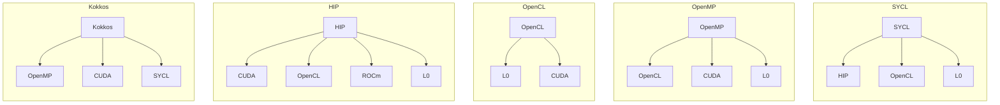
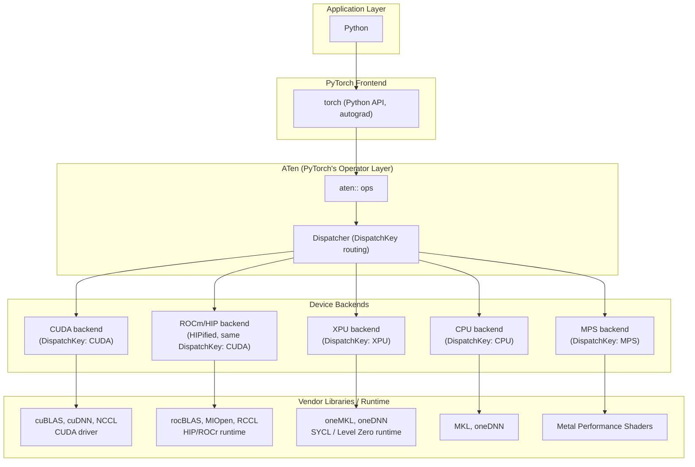

<a href="">

</a>

# THAPI/iprof: Tracing Heterogeneous APIs

1. Introduction
2. Features Showcase
   - No Code Changes, Open Trace Format, Perfetto Native Timeline
   - Programming-Model-Based Tracing
   - Intel ITT Backend
   - Heterogeneous Programming Models: CPU + XPU
   - Heterogeneous Programming Models: CPU + GPU
   - Distributed Computing (MPI)
3. DistributedDataParallel

**References:** [THAPI repository](https://github.com/argonne-lcf/THAPI)

---

### 1. Introduction

THAPI is the tracing infrastructure for heterogeneous computing applications.
`iprof` is the command line tool.

**Usage**

```bash
iprof <executable>
iprof -- python model.py
```

```bash
mpirun iprof -- <executable>
mpirun iprof -- python model.py
```

- THAPI is a generic framework for heterogeneous applications.

| Languages | Prospective Languages | Programming Models | Domain-Based Programming Models |
|---|---|---|---|
| <ul><li>FORTRAN</li><li>C</li><li>C++</li><li>**Python**</li></ul> | <ul><li>Julia</li><li>Lua</li><li>PGAS approaches</li></ul> | <ul><li>**MPI**</li><li>OpenMP</li><li>**CUDA**, **L0**, **ROCm**, **HIP**, **OpenCL**</li><li>SYCL, Kokkos, Raja</li></ul> | <ul><li>Linear algebra: BLAS/LAPACK</li><li>FFTs: cuFFT, FFTWx, MKL FFT</li><li>Low-level AI: cuDNN, clDNN, Intel DNNL</li><li>AI/ML: TensorFlow, Caffe, **PyTorch**</li></ul> |

**Diagram 1: Programming-model interrelation**



- AI/ML workloads are just another, domain-specific case of heterogeneous
  application that THAPI can address. PyTorch itself dispatches to a
  different programming model per device.

**Diagram 2: The PyTorch case**



**Supported backends**

| Backend | Keywords |
|---|---|
| **MPI** | distributed memory, point-to-point, collectives |
| **OpenMP** | shared memory, threads, parallel regions |
| **OpenCL** | cross-vendor, `cl*` calls, command queues |
| **Level Zero (L0)** | Intel GPU, `ze*` calls, oneAPI/SYCL |
| **CUDA** | NVIDIA GPU, runtime + driver API |
| **HIP** | AMD GPU, CUDA-portable, `hip*` calls |
| **CXI** | HPE Slingshot, network fabric, NIC |
| **ITT** | Intel instrumentation, named tasks, VTune |
| **PyTorch** | `aten::*` ops, RecordFunction, no code changes |

---

### 2. Features Showcase

#### 2.1 No Code Changes, Open Trace Format, Perfetto Native Timeline

The base code below is traced as-is. No `with profile(...):`, no
`emit_itt()`, no import added.

```bash
iprof -- python model.py
```

```python
# model.py
import torch
x = torch.randn(2048, 2048, device="xpu")
y = torch.matmul(x, x)
torch.xpu.synchronize()
```

```text
BACKEND_PYTORCH | 1 Hostnames | 1 Processes | 1 Threads |

         Name |    Time | Time(%) | Calls | Average |    Min |     Max |
 aten::matmul | 64.61ms |  47.85% |     1 | 64.61ms | 64.61ms | 64.61ms |
     aten::mm | 64.57ms |  47.83% |     1 | 64.57ms | 64.57ms | 64.57ms |
...

BACKEND_OPENCL,BACKEND_ZE | 1 Hostnames | 1 Processes | 1 Threads |

                          Name |    Time | Time(%) | Calls | Average |    Min |     Max |
   zeContextMakeMemoryResident | 7.13ms |  38.00% |   324 | 21.99us | 5.88us | 324.15us |
         zeDeviceCanAccessPeer | 3.16ms |  16.86% |   132 | 23.96us |  171ns |  70.67us |
...

Device profiling | 1 Hostnames | 1 Processes | 1 Threads | 1 Devices | 1 Subdevices |

                                                                      Name |    Time | Time(%) | Calls |  Average |
                                                               gemm_kernel | 817.60us |  93.85% |     1 | 817.60us |
at::native::xpu::DistributionElementw[...]alTransformFunctor<float, float>, int> | 41.92us | 4.81% | 1 | 41.92us |
...
```

📄 [Full tally](02_1_no_code_changes/iprof_summary.txt) ·
[Raw trace](02_1_no_code_changes/raw_trace.txt) ·
[Intervals](02_1_no_code_changes/intervals.txt) ·
[Aggregations](02_1_no_code_changes/aggregations.txt)

🔗 [Explore this trace in Perfetto](https://ui.perfetto.dev/#!/?url=https://raw.githubusercontent.com/DonAurelio/notes/main/slides/2026_iprof_showcase/02_1_no_code_changes/iprof_timeline.pftrace)

#### 2.2 Programming-Model-Based Tracing

THAPI hooks each programming model's own API (`ze*`, `cl*`, `aten::*`).
The trace reads in the application's own vocabulary, not generic call
stacks.

```bash
iprof --trace -- python model.py
```

```text
13:35:43.811594697 - x4619c0s6b0n0 - vpid: 446330, vtid: 446330 - lttng_ust_ze_properties:device: {
  hDriver: 0x0000558014c32e28,
  hDevice: 0x0000558014c2e218,
  pDeviceProperties_val: {
    stype: ZE_STRUCTURE_TYPE_DEVICE_PROPERTIES,
    pNext: 0x0000000000000000,
    type: ZE_DEVICE_TYPE_GPU,
    vendorId: 32902,
    deviceId: 3030,
    flags: [],
    subdeviceId: 0,
    coreClockRate: 1500,
    maxMemAllocSize: 65267564544,
    maxHardwareContexts: 65536,
    maxCommandQueuePriority: 0,
    numThreadsPerEU: 8,
    physicalEUSimdWidth: 16,
    numEUsPerSubslice: 8,
    numSubslicesPerSlice: 56,
    numSlices: 1,
    timerResolution: 80,
    timestampValidBits: 36,
    kernelTimestampValidBits: 32,
    uuid: { id: 01000000-0000-0000-ec8e-6e2d93f4a1ac },
    name: Intel(R) Data Center GPU Max 1550
  }
}
...
13:35:44.048636859 - x4619c0s6b0n0 - vpid: 446330, vtid: 446330 - lttng_ust_pytorch:op_entry: {
  name: "aten::randn",
  overload_name: ""
}
...
13:35:44.055134546 - x4619c0s6b0n0 - vpid: 446330, vtid: 446330 - lttng_ust_pytorch:op_exit: {
  name: "aten::randn",
  overload_name: ""
}
13:35:44.055211313 - x4619c0s6b0n0 - vpid: 446330, vtid: 446330 - lttng_ust_pytorch:op_entry: {
  name: "aten::matmul",
  overload_name: ""
}
...
13:35:44.055241550 - x4619c0s6b0n0 - vpid: 446330, vtid: 446330 - lttng_ust_ze:zeMemAllocDevice_entry: {
  hContext: 0x0000558016125158,
  device_desc: 0x00007ffe909074d8,
  size: 16777216,
  alignment: 512,
  hDevice: 0x0000558014c2e218,
  pptr: 0x00007ffe90907580,
  device_desc_val: {
    stype: ZE_STRUCTURE_TYPE_DEVICE_MEM_ALLOC_DESC,
    pNext: 0x0000000000000000,
    flags: [],
    ordinal: 0
  }
}
13:35:44.055296755 - x4619c0s6b0n0 - vpid: 446330, vtid: 446330 - lttng_ust_ze:zeMemAllocDevice_exit: {
  zeResult: ZE_RESULT_SUCCESS,
  pptr_val: 0xff00000001200000
}
...
13:35:44.120291133 - x4619c0s6b0n0 - vpid: 446330, vtid: 446330 - lttng_ust_pytorch:op_exit: {
  name: "aten::matmul",
  overload_name: ""
}
```

The `hDevice` in `zeMemAllocDevice_entry` (`0x0000558014c2e218`) matches the
`hDevice` the `device` properties event reported earlier for this same GPU,
correlating the allocation to a specific device.

📄 [Full raw trace](02_1_no_code_changes/raw_trace.txt)

Because tracing happens at this level, a call that fails is still captured
as-is. On the Aurora login node, with no XPU present, `zeInit` shows up
returning an error instead of silently vanishing.

```bash
iprof --trace -- python3 -c "import torch; torch.zeros(1, device='xpu')"
```

```text
13:46:47.480452608 - aurora-uan-0011 - vpid: 1915916, vtid: 1915916 - lttng_ust_ze:zeInit_entry: { flags: [ ZE_INIT_FLAG_GPU_ONLY ] }
13:46:47.480464747 - aurora-uan-0011 - vpid: 1915916, vtid: 1915916 - lttng_ust_ze:zeInit_exit: { zeResult: ZE_RESULT_ERROR_UNINITIALIZED }
```

Useful for diagnosing where an application actually ran, not just what it
called.

📄 [Full raw trace (login node)](02_2_programming_model_based/login_trace.txt)

_TODO: overhead discussion (LTTng/babeltrace, and the associated
instrumentation cost) to be filled in._

#### 2.3 Intel ITT Backend

`emit_itt()` opens the ITT stream and auto-emits a range for every
RecordFunction-observed op in its scope. `itt.range_push`/`range_pop`
inject an additional, custom-named marker inside that same open stream.
`-b itt` restricts THAPI's trace to just the ITT backend.

```bash
iprof -b itt --analysis-output iprof_summary.txt -- python model.py
```

```python
# model.py
import torch
from torch.profiler import itt

x = torch.randn(2048, 2048, device="xpu")
with torch.autograd.profiler.emit_itt():
    itt.range_push("my_matmul")
    y = torch.matmul(x, x)
    itt.range_pop()
torch.xpu.synchronize()
```

```text
BACKEND_ITT | 1 Hostnames | 1 Processes | 1 Threads |

                  Name |    Time | Time(%) | Calls | Average |    Min |     Max |
     PyTorch:my_matmul | 65.14ms |  33.31% |     1 | 65.14ms | 65.14ms | 65.14ms |
  PyTorch:aten::matmul | 65.05ms |  33.26% |     1 | 65.05ms | 65.05ms | 65.05ms |
...
```

The custom range (`PyTorch:my_matmul`) appears alongside the
RecordFunction-auto-named rows (`PyTorch:aten::matmul`, etc.). `-b itt`
isolates the backend, but doesn't change what's inside it; both mechanisms
fire from the same `emit_itt()` scope.

The raw trace shows the ITT API calls directly. The custom range opens
first, the auto-named ranges nest inside it, and the oneDNN domain opens
its own separate task:

```bash
iprof -b itt --trace -- python model.py
```

```text
14:50:04.245857082 - x4703c6s5b0n0 - vpid: 19659, vtid: 19659 - lttng_ust_itt:__itt_task_begin: { domain: 0x000055f00e19ecf0, taskid: { d1: 0, d2: 0, d3: 0 }, parentid: { d1: 0, d2: 0, d3: 0 }, name: 0x000055f01638cdb0, domain__nameA_val: "PyTorch", name__strA_val: "my_matmul" }
...
14:50:04.245910565 - x4703c6s5b0n0 - vpid: 19659, vtid: 19659 - lttng_ust_itt:__itt_task_begin: { domain: 0x000055f00e19ecf0, taskid: { d1: 0, d2: 0, d3: 0 }, parentid: { d1: 0, d2: 0, d3: 0 }, name: 0x000055f01638cf30, domain__nameA_val: "PyTorch", name__strA_val: "aten::matmul" }
...
14:50:04.342009433 - x4703c6s5b0n0 - vpid: 19659, vtid: 19659 - lttng_ust_itt:__itt_task_begin: { domain: 0x000055f018159880, taskid: { d1: 0, d2: 0, d3: 0 }, parentid: { d1: 0, d2: 0, d3: 0 }, name: 0x000055f01807e5e0, domain__nameA_val: "dnnl::primitive::execute", name__strA_val: "matmul" }
```

The interval trace turns each task begin/end pair into one row with a
duration, and confirms `my_matmul`'s own span (64.64ms) covers the nested
`aten::matmul` call (64.58ms) plus the small gap around it:

```text
lttng:host: { hostname = "x4703c6s5b0n0", vpid = 19831, vtid = 19831, ts = 1791471015044304462, backend = 9 }, { name = "PyTorch:my_matmul", dur = 64644254, err = 0 }
lttng:host: { hostname = "x4703c6s5b0n0", vpid = 19831, vtid = 19831, ts = 1791471015044358313, backend = 9 }, { name = "PyTorch:aten::matmul", dur = 64576739, err = 0 }
```

📄 [Full tally](02_3_itt_backend/iprof_summary.txt) ·
[Raw trace](02_3_itt_backend/raw_trace.txt) ·
[Intervals](02_3_itt_backend/intervals.txt) ·
[Aggregations](02_3_itt_backend/aggregations.txt)

🔗 [Explore this trace in Perfetto](https://ui.perfetto.dev/#!/?url=https://raw.githubusercontent.com/DonAurelio/notes/main/slides/2026_iprof_showcase/02_3_itt_backend/iprof_timeline.pftrace)
