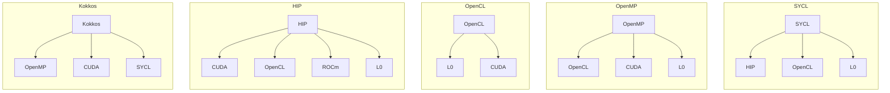
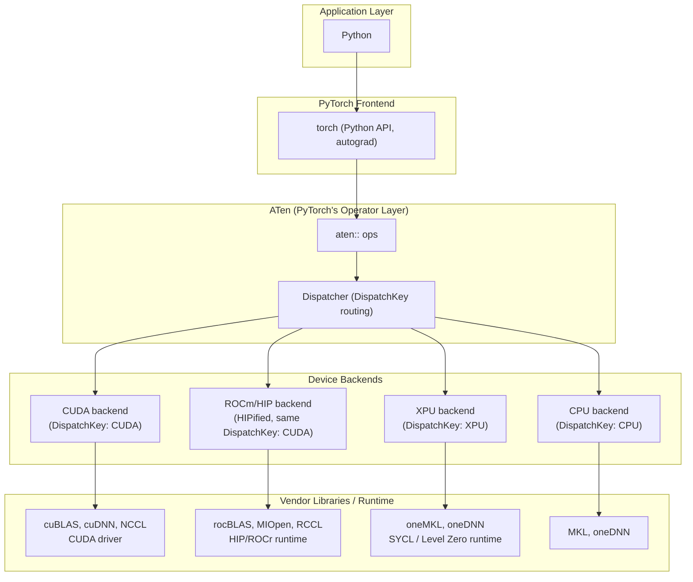

<a href="">

</a>

# [THAPI/iprof: Tracing Heterogeneous APIs](https://github.com/argonne-lcf/THAPI)

> [!NOTE]
> __THAPI is a generic framework for heterogeneous applications.__
> - `THAPI` is the tracing infrastructure.
> - `iprof` is the command line utility, e.g., `iprof -- python model.py`, `mpirun iprof -- python model.py`

| Languages | Prospective Languages | Programming Models | Domain-Based Programming Models |
|---|---|---|---|
| <ul><li>FORTRAN</li><li>C</li><li>C++</li><li>**Python**</li></ul> | <ul><li>Julia</li><li>Lua</li><li>PGAS approaches</li></ul> | <ul><li>**MPI**</li><li>OpenMP</li><li>**CUDA**, **L0**, **ROCm**, **HIP**, **OpenCL**</li><li>SYCL, Kokkos, Raja</li></ul> | <ul><li>Linear algebra: BLAS/LAPACK</li><li>FFTs: cuFFT, FFTWx, MKL FFT</li><li>Low-level AI: cuDNN, clDNN, Intel DNNL</li><li>AI/ML: TensorFlow, Caffe, **PyTorch**</li></ul> |

> [!NOTE]
> __We want to understand how applications use programming models, and how that usage impacts performance__



> [!NOTE]
> __AI/ML workloads are just another, domain-specific case of heterogeneous application that THAPI can address__



> [!IMPORTANT]
> **Supported backends**: MPI, OpenMP, OpenCL, Level Zero (L0), CUDA, HIP, CXI, ITT, PyTorch


# Easy to adopt

No Code Changes, Open Trace Format, Perfetto Native Timeline

```bash
iprof -- python model.py
```

```python
# model.py
import torch
x = torch.randn(2048, 2048, device="xpu")
y = torch.matmul(x, x)
torch.xpu.synchronize()
```

```text
BACKEND_PYTORCH | 1 Hostnames | 1 Processes | 1 Threads |

         Name |    Time | Time(%) | Calls | Average |    Min |     Max |
 aten::matmul | 64.61ms |  47.85% |     1 | 64.61ms | 64.61ms | 64.61ms |
     aten::mm | 64.57ms |  47.83% |     1 | 64.57ms | 64.57ms | 64.57ms |
...

BACKEND_OPENCL,BACKEND_ZE | 1 Hostnames | 1 Processes | 1 Threads |

                          Name |    Time | Time(%) | Calls | Average |    Min |     Max |
   zeContextMakeMemoryResident | 7.13ms |  38.00% |   324 | 21.99us | 5.88us | 324.15us |
         zeDeviceCanAccessPeer | 3.16ms |  16.86% |   132 | 23.96us |  171ns |  70.67us |
...

Device profiling | 1 Hostnames | 1 Processes | 1 Threads | 1 Devices | 1 Subdevices |

                                                                      Name |    Time | Time(%) | Calls |  Average |
                                                               gemm_kernel | 817.60us |  93.85% |     1 | 817.60us |
at::native::xpu::DistributionElementw[...]alTransformFunctor<float, float>, int> | 41.92us | 4.81% | 1 | 41.92us |
...
```

📄 [Full tally](02_1_no_code_changes/iprof_summary.txt) ·
[Raw trace](02_1_no_code_changes/raw_trace.txt) ·
[Intervals](02_1_no_code_changes/intervals.txt) ·
[Aggregations](02_1_no_code_changes/aggregations.txt)

🔗 [Explore this trace in Perfetto](https://ui.perfetto.dev/#!/?url=https://raw.githubusercontent.com/DonAurelio/notes/main/slides/2026_iprof_showcase/02_1_no_code_changes/iprof_timeline.pftrace)

# Trace already speaks the application's vocabulary

> [!IMPORTANT]
> THAPI captures as much **context** as possible while maintaining **minimal overhead** [[1](https://dl.acm.org/doi/10.1007/978-3-031-99854-6_4)].

```bash
iprof --trace -- python model.py
```

```text
13:35:43.811594697 - x4619c0s6b0n0 - vpid: 446330, vtid: 446330 - lttng_ust_ze_properties:device: {
  hDriver: 0x0000558014c32e28,
  hDevice: 0x0000558014c2e218,
  pDeviceProperties_val: {
    stype: ZE_STRUCTURE_TYPE_DEVICE_PROPERTIES,
    pNext: 0x0000000000000000,
    type: ZE_DEVICE_TYPE_GPU,
    vendorId: 32902,
    deviceId: 3030,
    flags: [],
    subdeviceId: 0,
    coreClockRate: 1500,
    maxMemAllocSize: 65267564544,
    maxHardwareContexts: 65536,
    maxCommandQueuePriority: 0,
    numThreadsPerEU: 8,
    physicalEUSimdWidth: 16,
    numEUsPerSubslice: 8,
    numSubslicesPerSlice: 56,
    numSlices: 1,
    timerResolution: 80,
    timestampValidBits: 36,
    kernelTimestampValidBits: 32,
    uuid: { id: 01000000-0000-0000-ec8e-6e2d93f4a1ac },
    name: Intel(R) Data Center GPU Max 1550
  }
}
...
13:35:44.048636859 - x4619c0s6b0n0 - vpid: 446330, vtid: 446330 - lttng_ust_pytorch:op_entry: {
  name: "aten::randn",
  overload_name: ""
}
...
13:35:44.055134546 - x4619c0s6b0n0 - vpid: 446330, vtid: 446330 - lttng_ust_pytorch:op_exit: {
  name: "aten::randn",
  overload_name: ""
}
13:35:44.055211313 - x4619c0s6b0n0 - vpid: 446330, vtid: 446330 - lttng_ust_pytorch:op_entry: {
  name: "aten::matmul",
  overload_name: ""
}
...
13:35:44.055241550 - x4619c0s6b0n0 - vpid: 446330, vtid: 446330 - lttng_ust_ze:zeMemAllocDevice_entry: {
  hContext: 0x0000558016125158,
  device_desc: 0x00007ffe909074d8,
  size: 16777216,
  alignment: 512,
  hDevice: 0x0000558014c2e218,
  pptr: 0x00007ffe90907580,
  device_desc_val: {
    stype: ZE_STRUCTURE_TYPE_DEVICE_MEM_ALLOC_DESC,
    pNext: 0x0000000000000000,
    flags: [],
    ordinal: 0
  }
}
13:35:44.055296755 - x4619c0s6b0n0 - vpid: 446330, vtid: 446330 - lttng_ust_ze:zeMemAllocDevice_exit: {
  zeResult: ZE_RESULT_SUCCESS,
  pptr_val: 0xff00000001200000
}
...
13:35:44.120291133 - x4619c0s6b0n0 - vpid: 446330, vtid: 446330 - lttng_ust_pytorch:op_exit: {
  name: "aten::matmul",
  overload_name: ""
}
```

The `hDevice` in `zeMemAllocDevice_entry` (`0x0000558014c2e218`) matches the
`hDevice` the `device` properties event reported earlier for this same GPU,
correlating the allocation to a specific device.

📄 [Full raw trace](02_1_no_code_changes/raw_trace.txt)

Because tracing happens at this level, a call that fails is still captured
as-is. On the Aurora login node, with no XPU present, `zeInit` shows up
returning an error instead of silently vanishing.

```bash
iprof --trace -- python3 -c "import torch; torch.zeros(1, device='xpu')"
```

```text
13:46:47.480452608 - aurora-uan-0011 - vpid: 1915916, vtid: 1915916 - lttng_ust_ze:zeInit_entry: { flags: [ ZE_INIT_FLAG_GPU_ONLY ] }
13:46:47.480464747 - aurora-uan-0011 - vpid: 1915916, vtid: 1915916 - lttng_ust_ze:zeInit_exit: { zeResult: ZE_RESULT_ERROR_UNINITIALIZED }
```

📄 [Full raw trace (login node)](02_2_programming_model_based/login_trace.txt)

# Minumal 
_TODO: overhead discussion (LTTng/babeltrace, and the associated
instrumentation cost) to be filled in._

#### 2.3 Performance Counter Sampling (CXI)

`-s`/`--sample` starts a background sampling daemon that reads hardware
counters on a fixed interval, independent of the workload's own
instrumented calls. The CXI plugin samples real Slingshot NIC telemetry
under `/sys/class/cxi/*/device/telemetry` every 100ms by default.

```bash
iprof --sample --backend cxi,pytorch --trace -- python model.py
```

```python
# model.py
import torch
x = torch.randn(2048, 2048, device="xpu")
y = torch.matmul(x, x)
torch.xpu.synchronize()
```

Sampling runs on its own clock, not tied to any traced call. Each tick
emits one event per counter per NIC interface:

```text
15:54:25.703629402 - x4116c4s4b0n0 - vpid: 145452, vtid: 145713 - lttng_ust_cxi_sampling:cxi: {interface_name: cxi6 , counter: pct_eth_packets , value: 126480}
15:54:25.703632740 - x4116c4s4b0n0 - vpid: 145452, vtid: 145713 - lttng_ust_cxi_sampling:cxi: {interface_name: cxi6 , counter: pct_mem_cor_err_cntr , value: 0}
...
```

The interval view turns each tick into one row per counter, and strung
together they show the counter accumulating independently of the
application's own `aten::*` calls, which run on a separate thread
(`sampling:nic` carries no `vpid`/`vtid`, unlike the `lttng:host` rows
from the traced process):

```text
sampling:nic: { hostname = "x4116c4s4b0n0", ts = 1791474932332351582 }, { interface_name = "cxi4", counter = "pct_eth_packets", value = 104 }
sampling:nic: { hostname = "x4116c4s4b0n0", ts = 1791474932432308058 }, { interface_name = "cxi4", counter = "pct_eth_packets", value = 220 }
sampling:nic: { hostname = "x4116c4s4b0n0", ts = 1791474932532365693 }, { interface_name = "cxi4", counter = "pct_eth_packets", value = 334 }
...
```

Those three timestamps are ~100ms apart, matching the sampling period,
and keep incrementing well past the short `aten::matmul` call itself;
this is the fixed-rate telemetry stream the ITT/PyTorch backends don't
provide.

Two things to know when using `-s`:

- Counter samples only show up in the raw trace, the interval view, and
  the Perfetto timeline, not in the tally (`--analysis-output`). The
  tally aggregates named, duration-based calls; periodic counter samples
  aren't that, so `to_aggreg` doesn't carry them. Read sampling data from
  the raw/interval/timeline views instead.
- Restrict `--backend` to only what's needed (`cxi,pytorch` here). Asking
  for `-s` with the default backend set also tries to load the ZE
  sampling plugin, and on this system that crashes the sampling daemon
  outright (`libffi.so.8: cannot open shared object file`), which
  silently drops every counter, CXI included, with no error surfaced to
  `iprof`. That silent failure, combined with not knowing to look in the
  interval/timeline views instead of the tally, is what looked like a
  CXI-specific bug at first.

📄 [Full raw trace](02_3_cxi_sampling/raw_trace.txt) ·
[Intervals](02_3_cxi_sampling/intervals.txt) ·
[Aggregations (PyTorch calls only)](02_3_cxi_sampling/aggregations.txt) ·
[Tally (PyTorch calls only)](02_3_cxi_sampling/iprof_summary.txt)

🔗 [Explore this trace in Perfetto](https://ui.perfetto.dev/#!/?url=https://raw.githubusercontent.com/DonAurelio/notes/main/slides/2026_iprof_showcase/02_3_cxi_sampling/iprof_timeline.pftrace)

#### 2.4 Intel ITT Backend

`emit_itt()` opens the ITT stream and auto-emits a range for every
RecordFunction-observed op in its scope. `itt.range_push`/`range_pop`
inject an additional, custom-named marker inside that same open stream.
`-b itt` restricts THAPI's trace to just the ITT backend.

```bash
iprof -b itt --analysis-output iprof_summary.txt -- python model.py
```

```python
# model.py
import torch
from torch.profiler import itt

x = torch.randn(2048, 2048, device="xpu")
with torch.autograd.profiler.emit_itt():
    itt.range_push("my_matmul")
    y = torch.matmul(x, x)
    itt.range_pop()
torch.xpu.synchronize()
```

```text
BACKEND_ITT | 1 Hostnames | 1 Processes | 1 Threads |

                  Name |    Time | Time(%) | Calls | Average |    Min |     Max |
     PyTorch:my_matmul | 65.14ms |  33.31% |     1 | 65.14ms | 65.14ms | 65.14ms |
  PyTorch:aten::matmul | 65.05ms |  33.26% |     1 | 65.05ms | 65.05ms | 65.05ms |
...
```

The custom range (`PyTorch:my_matmul`) appears alongside the
RecordFunction-auto-named rows (`PyTorch:aten::matmul`, etc.). `-b itt`
isolates the backend, but doesn't change what's inside it; both mechanisms
fire from the same `emit_itt()` scope.

The raw trace shows the ITT API calls directly. The custom range opens
first, the auto-named ranges nest inside it, and the oneDNN domain opens
its own separate task:

```bash
iprof -b itt --trace -- python model.py
```

```text
14:50:04.245857082 - x4703c6s5b0n0 - vpid: 19659, vtid: 19659 - lttng_ust_itt:__itt_task_begin: { domain: 0x000055f00e19ecf0, taskid: { d1: 0, d2: 0, d3: 0 }, parentid: { d1: 0, d2: 0, d3: 0 }, name: 0x000055f01638cdb0, domain__nameA_val: "PyTorch", name__strA_val: "my_matmul" }
...
14:50:04.245910565 - x4703c6s5b0n0 - vpid: 19659, vtid: 19659 - lttng_ust_itt:__itt_task_begin: { domain: 0x000055f00e19ecf0, taskid: { d1: 0, d2: 0, d3: 0 }, parentid: { d1: 0, d2: 0, d3: 0 }, name: 0x000055f01638cf30, domain__nameA_val: "PyTorch", name__strA_val: "aten::matmul" }
...
14:50:04.342009433 - x4703c6s5b0n0 - vpid: 19659, vtid: 19659 - lttng_ust_itt:__itt_task_begin: { domain: 0x000055f018159880, taskid: { d1: 0, d2: 0, d3: 0 }, parentid: { d1: 0, d2: 0, d3: 0 }, name: 0x000055f01807e5e0, domain__nameA_val: "dnnl::primitive::execute", name__strA_val: "matmul" }
```

The interval trace turns each task begin/end pair into one row with a
duration, and confirms `my_matmul`'s own span (64.64ms) covers the nested
`aten::matmul` call (64.58ms) plus the small gap around it:

```text
lttng:host: { hostname = "x4703c6s5b0n0", vpid = 19831, vtid = 19831, ts = 1791471015044304462, backend = 9 }, { name = "PyTorch:my_matmul", dur = 64644254, err = 0 }
lttng:host: { hostname = "x4703c6s5b0n0", vpid = 19831, vtid = 19831, ts = 1791471015044358313, backend = 9 }, { name = "PyTorch:aten::matmul", dur = 64576739, err = 0 }
```

📄 [Full tally](02_4_itt_backend/iprof_summary.txt) ·
[Raw trace](02_4_itt_backend/raw_trace.txt) ·
[Intervals](02_4_itt_backend/intervals.txt) ·
[Aggregations](02_4_itt_backend/aggregations.txt)

🔗 [Explore this trace in Perfetto](https://ui.perfetto.dev/#!/?url=https://raw.githubusercontent.com/DonAurelio/notes/main/slides/2026_iprof_showcase/02_4_itt_backend/iprof_timeline.pftrace)

#### 2.5 Heterogeneous Programming Models: CPU + XPU

The same `aten::matmul` call dispatches to a different backend depending
on the tensor's device. One process, two programming models, one trace.

```bash
iprof --analysis-output iprof_summary.txt -- python model.py
```

```python
# model.py
import torch

xc = torch.randn(2048, 2048, device="cpu")
yc = torch.matmul(xc, xc)

xg = torch.randn(2048, 2048, device="xpu")
yg = torch.matmul(xg, xg)
torch.xpu.synchronize()
```

The tally shows `BACKEND_PYTORCH` with two calls to `aten::matmul`; the
device backends only light up for the XPU call:

```text
BACKEND_PYTORCH | 1 Hostnames | 1 Processes | 1 Threads |

         Name |     Time | Time(%) | Calls |  Average |     Min |      Max |
  aten::matmul |  81.51ms |  38.11% |     2 |  40.76ms | 16.37ms |  65.15ms |
      aten::mm |  81.47ms |  38.09% |     2 |  40.73ms | 16.33ms |  65.14ms |
...

BACKEND_OPENCL,BACKEND_ZE | 1 Hostnames | 1 Processes | 1 Threads |

                        Name |    Time | Time(%) | Calls |  Average |     Min |      Max |
 zeContextMakeMemoryResident |  7.21ms |  38.11% |   324 |  22.26us |  5.74us | 325.22us |
       zeDeviceCanAccessPeer |  3.12ms |  16.48% |   132 |  23.63us |   173ns |  73.13us |
...

Device profiling | 1 Hostnames | 1 Processes | 1 Threads | 1 Devices | 1 Subdevices |

     Name |     Time | Time(%) | Calls |  Average |      Min |      Max |
gemm_kernel | 818.40us |  93.78% |     1 | 818.40us | 818.40us | 818.40us |
...
```

The CPU `aten::matmul` runs with no ZE/OpenCL calls and no device kernel
around it; the XPU one is surrounded by both. The raw trace makes this
explicit. The CPU call's entry/exit pair has only PyTorch events around
it:

```bash
iprof --trace -- python model.py
```

```text
15:22:32.549006501 - x4703c6s5b0n0 - vpid: 59280, vtid: 59280 - lttng_ust_pytorch:op_entry: {
  name: "aten::matmul",
  overload_name: ""
}
...
15:22:32.856048785 - x4703c6s5b0n0 - vpid: 59280, vtid: 59280 - lttng_ust_pytorch:op_exit: {
  name: "aten::matmul",
  overload_name: ""
}
```

The XPU call's entry/exit pair has `zeMemAllocDevice`,
`zeContextMakeMemoryResident`, and a kernel launch in between:

```text
15:22:33.155141065 - x4703c6s5b0n0 - vpid: 59280, vtid: 59280 - lttng_ust_pytorch:op_entry: {
  name: "aten::matmul",
  overload_name: ""
}
...
15:22:33.155171430 - x4703c6s5b0n0 - vpid: 59280, vtid: 59280 - lttng_ust_ze:zeMemAllocDevice_entry: {
  hContext: 0x0000563c348b3668,
  device_desc: 0x00007fffcb14d058,
  size: 16777216,
  alignment: 512,
  hDevice: 0x0000563c333bd708,
  pptr: 0x00007fffcb14d100,
  device_desc_val: {
    stype: ZE_STRUCTURE_TYPE_DEVICE_MEM_ALLOC_DESC,
    pNext: 0x0000000000000000,
    flags: [],
    ordinal: 0
  }
}
...
15:22:33.221035908 - x4703c6s5b0n0 - vpid: 59280, vtid: 59280 - lttng_ust_ze:zeCommandListAppendLaunchKernel_entry: {
  hCommandList: 0x0000563c35aff2a8,
  hKernel: 0x0000563c2ed79ce8,
  pLaunchFuncArgs: 0x00007fffcb149040,
  hSignalEvent: 0x0000563c380885d8,
  numWaitEvents: 1,
  phWaitEvents: 0x0000563c38088590,
  pLaunchFuncArgs_val: {
    groupCountX: 224,
    groupCountY: 1,
    groupCountZ: 1
  },
  phWaitEvents_vals: [ 0x0000563c35bba7d8 ]
}
...
15:22:33.221098107 - x4703c6s5b0n0 - vpid: 59280, vtid: 59280 - lttng_ust_pytorch:op_exit: {
  name: "aten::matmul",
  overload_name: ""
}
```

The interval view confirms the duration difference directly; the CPU
call takes almost five times as long as the XPU one on this run:

```text
lttng:host: { hostname = "x4703c6s5b0n0", vpid = 59280, vtid = 59280, ts = 1791472952549006501, backend = 10 }, { name = "aten::matmul", dur = 307042284, err = 0 }
lttng:host: { hostname = "x4703c6s5b0n0", vpid = 59280, vtid = 59280, ts = 1791472953155141065, backend = 10 }, { name = "aten::matmul", dur = 65957042, err = 0 }
```

The aggregation view collapses both calls into one row by name; it
reports `count = 2` with `min`/`max` spanning both runs, but it can't by
itself tell which call ran on which device. That distinction only shows
up in the raw trace or the per-event interval view, not in the
aggregate:

```text
aggreg:host: { hostname = "x4703c6s5b0n0", vpid = 59280, vtid = 59280, name = "aten::matmul", min = 65957042, max = 307042284, total = 372999326, count = 2 }, { backend = 10, err_count = 0 }
```

📄 [Full tally](02_5_cpu_xpu/iprof_summary.txt) ·
[Raw trace](02_5_cpu_xpu/raw_trace.txt) ·
[Intervals](02_5_cpu_xpu/intervals.txt) ·
[Aggregations](02_5_cpu_xpu/aggregations.txt)

🔗 [Explore this trace in Perfetto](https://ui.perfetto.dev/#!/?url=https://raw.githubusercontent.com/DonAurelio/notes/main/slides/2026_iprof_showcase/02_5_cpu_xpu/iprof_timeline.pftrace)
