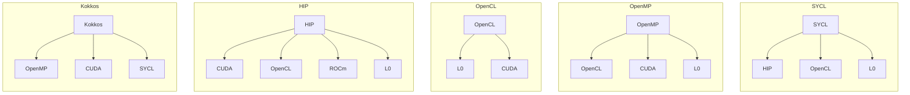
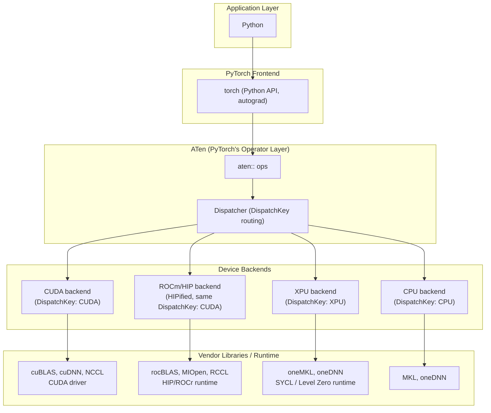

<a href="">

</a>

# [THAPI/iprof: Tracing Heterogeneous APIs](https://github.com/argonne-lcf/THAPI)

> [!NOTE]
> __THAPI is a generic framework for heterogeneous applications.__
> - `THAPI` is the tracing infrastructure.
> - `iprof` is the command line utility, e.g., `iprof -- python model.py`, `mpirun iprof -- python model.py`

| Languages | Prospective Languages | Programming Models | Domain-Based Programming Models |
|---|---|---|---|
| <ul><li>FORTRAN</li><li>C</li><li>C++</li><li>**Python**</li></ul> | <ul><li>Julia</li><li>Lua</li><li>PGAS approaches</li></ul> | <ul><li>**MPI**</li><li>OpenMP</li><li>**CUDA**, **L0**, **ROCm**, **HIP**, **OpenCL**</li><li>SYCL, Kokkos, Raja</li></ul> | <ul><li>Linear algebra: BLAS/LAPACK</li><li>FFTs: cuFFT, FFTWx, MKL FFT</li><li>Low-level AI: cuDNN, clDNN, Intel DNNL</li><li>AI/ML: TensorFlow, Caffe, **PyTorch**</li></ul> |

> [!NOTE]
> __We want to understand how applications use programming models, and how that usage impacts performance__



> [!NOTE]
> __AI/ML workloads are just another, domain-specific case of heterogeneous application that THAPI can address__



> [!IMPORTANT]
> **Supported backends**: MPI, OpenMP, OpenCL, Level Zero (L0), CUDA, HIP, CXI, ITT, PyTorch

# Easy to adopt

No Code Changes, Open Trace Format, Perfetto Native Timeline

```bash
iprof -- python model.py
```

```python
# model.py
import torch
x = torch.randn(2048, 2048, device="xpu")
y = torch.matmul(x, x)
torch.xpu.synchronize()
```

```text
BACKEND_PYTORCH | 1 Hostnames | 1 Processes | 1 Threads |

         Name |    Time | Time(%) | Calls | Average |    Min |     Max |
 aten::matmul | 64.61ms |  47.85% |     1 | 64.61ms | 64.61ms | 64.61ms |
     aten::mm | 64.57ms |  47.83% |     1 | 64.57ms | 64.57ms | 64.57ms |
...

BACKEND_OPENCL,BACKEND_ZE | 1 Hostnames | 1 Processes | 1 Threads |

                          Name |    Time | Time(%) | Calls | Average |    Min |     Max |
   zeContextMakeMemoryResident | 7.13ms |  38.00% |   324 | 21.99us | 5.88us | 324.15us |
         zeDeviceCanAccessPeer | 3.16ms |  16.86% |   132 | 23.96us |  171ns |  70.67us |
...

Device profiling | 1 Hostnames | 1 Processes | 1 Threads | 1 Devices | 1 Subdevices |

                                                                      Name |    Time | Time(%) | Calls |  Average |
                                                               gemm_kernel | 817.60us |  93.85% |     1 | 817.60us |
at::native::xpu::DistributionElementw[...]alTransformFunctor<float, float>, int> | 41.92us | 4.81% | 1 | 41.92us |
...
```

📄 [Full tally](02_1_no_code_changes/iprof_summary.txt) ·
[Raw trace](02_1_no_code_changes/raw_trace.txt) ·
[Intervals](02_1_no_code_changes/intervals.txt) ·
[Aggregations](02_1_no_code_changes/aggregations.txt)

🔗 [Explore this trace in Perfetto](https://ui.perfetto.dev/#!/?url=https://raw.githubusercontent.com/DonAurelio/notes/main/slides/2026_iprof_showcase/02_1_no_code_changes/iprof_timeline.pftrace)

# Trace already speaks the application's vocabulary

> [!IMPORTANT]
> THAPI captures as much **context** as possible while maintaining **minimal overhead** [[1](https://dl.acm.org/doi/10.1007/978-3-031-99854-6_4)].

```bash
iprof --trace -- python model.py
```

```text
13:35:43.811594697 - x4619c0s6b0n0 - vpid: 446330, vtid: 446330 - lttng_ust_ze_properties:device: {
  hDriver: 0x0000558014c32e28,
  hDevice: 0x0000558014c2e218,
  pDeviceProperties_val: {
    stype: ZE_STRUCTURE_TYPE_DEVICE_PROPERTIES,
    pNext: 0x0000000000000000,
    type: ZE_DEVICE_TYPE_GPU,
    vendorId: 32902,
    deviceId: 3030,
    flags: [],
    subdeviceId: 0,
    coreClockRate: 1500,
    maxMemAllocSize: 65267564544,
    maxHardwareContexts: 65536,
    maxCommandQueuePriority: 0,
    numThreadsPerEU: 8,
    physicalEUSimdWidth: 16,
    numEUsPerSubslice: 8,
    numSubslicesPerSlice: 56,
    numSlices: 1,
    timerResolution: 80,
    timestampValidBits: 36,
    kernelTimestampValidBits: 32,
    uuid: { id: 01000000-0000-0000-ec8e-6e2d93f4a1ac },
    name: Intel(R) Data Center GPU Max 1550
  }
}
...
13:35:44.048636859 - x4619c0s6b0n0 - vpid: 446330, vtid: 446330 - lttng_ust_pytorch:op_entry: {
  name: "aten::randn",
  overload_name: ""
}
...
13:35:44.055134546 - x4619c0s6b0n0 - vpid: 446330, vtid: 446330 - lttng_ust_pytorch:op_exit: {
  name: "aten::randn",
  overload_name: ""
}
13:35:44.055211313 - x4619c0s6b0n0 - vpid: 446330, vtid: 446330 - lttng_ust_pytorch:op_entry: {
  name: "aten::matmul",
  overload_name: ""
}
...
13:35:44.055241550 - x4619c0s6b0n0 - vpid: 446330, vtid: 446330 - lttng_ust_ze:zeMemAllocDevice_entry: {
  hContext: 0x0000558016125158,
  device_desc: 0x00007ffe909074d8,
  size: 16777216,
  alignment: 512,
  hDevice: 0x0000558014c2e218,
  pptr: 0x00007ffe90907580,
  device_desc_val: {
    stype: ZE_STRUCTURE_TYPE_DEVICE_MEM_ALLOC_DESC,
    pNext: 0x0000000000000000,
    flags: [],
    ordinal: 0
  }
}
13:35:44.055296755 - x4619c0s6b0n0 - vpid: 446330, vtid: 446330 - lttng_ust_ze:zeMemAllocDevice_exit: {
  zeResult: ZE_RESULT_SUCCESS,
  pptr_val: 0xff00000001200000
}
...
13:35:44.120291133 - x4619c0s6b0n0 - vpid: 446330, vtid: 446330 - lttng_ust_pytorch:op_exit: {
  name: "aten::matmul",
  overload_name: ""
}
```

The `hDevice` in `zeMemAllocDevice_entry` (`0x0000558014c2e218`) matches the
`hDevice` the `device` properties event reported earlier for this same GPU,
correlating the allocation to a specific device.

📄 [Full raw trace](02_1_no_code_changes/raw_trace.txt)

Because tracing happens at this level, a call that fails is still captured
as-is. On the Aurora login node, with no XPU present, `zeInit` shows up
returning an error instead of silently vanishing.

```bash
iprof --trace -- python3 -c "import torch; torch.zeros(1, device='xpu')"
```

```text
13:46:47.480452608 - aurora-uan-0011 - vpid: 1915916, vtid: 1915916 - lttng_ust_ze:zeInit_entry: { flags: [ ZE_INIT_FLAG_GPU_ONLY ] }
13:46:47.480464747 - aurora-uan-0011 - vpid: 1915916, vtid: 1915916 - lttng_ust_ze:zeInit_exit: { zeResult: ZE_RESULT_ERROR_UNINITIALIZED }
```

📄 [Full raw trace (login node)](02_2_programming_model_based/login_trace.txt)

# Hardware counters, straight from the NIC

THAPI samples genuine **Slingshot NIC telemetry** directly from hardware, independent of the application's **instrumented calls**.

```bash
iprof --sample --backend cxi,pytorch --trace -- python model.py
```

```python
# model.py
import torch
x = torch.randn(2048, 2048, device="xpu")
y = torch.matmul(x, x)
torch.xpu.synchronize()
```

Sampling runs on its own clock, not tied to any traced call. Each tick emits one event per counter per NIC interface:

```text
15:54:25.703629402 - x4116c4s4b0n0 - vpid: 145452, vtid: 145713 - lttng_ust_cxi_sampling:cxi: {interface_name: cxi6 , counter: pct_eth_packets , value: 126480}
15:54:25.703632740 - x4116c4s4b0n0 - vpid: 145452, vtid: 145713 - lttng_ust_cxi_sampling:cxi: {interface_name: cxi6 , counter: pct_mem_cor_err_cntr , value: 0}
...
```

📄 [Full raw trace](02_3_cxi_sampling/raw_trace.txt)

```text
sampling:nic: { hostname = "x4116c4s4b0n0", ts = 1791474932332351582 }, { interface_name = "cxi4", counter = "pct_eth_packets", value = 104 }
sampling:nic: { hostname = "x4116c4s4b0n0", ts = 1791474932432308058 }, { interface_name = "cxi4", counter = "pct_eth_packets", value = 220 }
sampling:nic: { hostname = "x4116c4s4b0n0", ts = 1791474932532365693 }, { interface_name = "cxi4", counter = "pct_eth_packets", value = 334 }
...
```

📄 [Full raw intervals](02_3_cxi_sampling/intervals.txt) 

📄 [Aggregations (PyTorch calls only)](02_3_cxi_sampling/aggregations.txt) ·
📄 [Tally (PyTorch calls only)](02_3_cxi_sampling/iprof_summary.txt)

🔗 [Explore this trace in Perfetto (PyTorch calls only)](https://ui.perfetto.dev/#!/?url=https://raw.githubusercontent.com/DonAurelio/notes/main/slides/2026_iprof_showcase/02_3_cxi_sampling/iprof_timeline.pftrace)

# Application-level markers make the timeline easier to navigate

THAPI captures ITT regions emitted at the application level, making THAPI/iprof timelines easier to navigate alongside custom-named markers.

```bash
iprof -b itt --analysis-output iprof_summary.txt -- python model.py
```

```python
# model.py
import torch
from torch.profiler import itt

x = torch.randn(2048, 2048, device="xpu")
with torch.autograd.profiler.emit_itt():
    itt.range_push("my_matmul")
    y = torch.matmul(x, x)
    itt.range_pop()
torch.xpu.synchronize()
```

```text
BACKEND_ITT | 1 Hostnames | 1 Processes | 1 Threads |

                  Name |    Time | Time(%) | Calls | Average |    Min |     Max |
     PyTorch:my_matmul | 65.14ms |  33.31% |     1 | 65.14ms | 65.14ms | 65.14ms |
  PyTorch:aten::matmul | 65.05ms |  33.26% |     1 | 65.05ms | 65.05ms | 65.05ms |
...
```

📄 [Full tally](02_4_itt_backend/iprof_summary.txt) ·
[Raw trace](02_4_itt_backend/raw_trace.txt) ·
[Intervals](02_4_itt_backend/intervals.txt) ·
[Aggregations](02_4_itt_backend/aggregations.txt)

🔗 [Explore this trace in Perfetto](https://ui.perfetto.dev/#!/?url=https://raw.githubusercontent.com/DonAurelio/notes/main/slides/2026_iprof_showcase/02_4_itt_backend/iprof_timeline.pftrace)

# Same call, different device, one timeline

The same `aten::matmul` call dispatches to a different backend depending on the tensor's device.

```bash
iprof --analysis-output iprof_summary.txt -- python model.py
```

```python
# model.py
import torch

xc = torch.randn(2048, 2048, device="cpu")
yc = torch.matmul(xc, xc)

xg = torch.randn(2048, 2048, device="xpu")
yg = torch.matmul(xg, xg)
torch.xpu.synchronize()
```

The tally shows `BACKEND_PYTORCH` with two calls to `aten::matmul`; the device backends only light up for the XPU call:

```text
BACKEND_PYTORCH | 1 Hostnames | 1 Processes | 1 Threads |

         Name |     Time | Time(%) | Calls |  Average |     Min |      Max |
  aten::matmul |  81.51ms |  38.11% |     2 |  40.76ms | 16.37ms |  65.15ms |
      aten::mm |  81.47ms |  38.09% |     2 |  40.73ms | 16.33ms |  65.14ms |
...

BACKEND_OPENCL,BACKEND_ZE | 1 Hostnames | 1 Processes | 1 Threads |

                        Name |    Time | Time(%) | Calls |  Average |     Min |      Max |
 zeContextMakeMemoryResident |  7.21ms |  38.11% |   324 |  22.26us |  5.74us | 325.22us |
       zeDeviceCanAccessPeer |  3.12ms |  16.48% |   132 |  23.63us |   173ns |  73.13us |
...

Device profiling | 1 Hostnames | 1 Processes | 1 Threads | 1 Devices | 1 Subdevices |

     Name |     Time | Time(%) | Calls |  Average |      Min |      Max |
gemm_kernel | 818.40us |  93.78% |     1 | 818.40us | 818.40us | 818.40us |
...
```

The CPU `aten::matmul` runs with no ZE/OpenCL calls and no device kernel
around it; the XPU one is surrounded by both. The raw trace makes this
explicit. The CPU call's entry/exit pair has only PyTorch events around
it:

```bash
iprof --trace -- python model.py
```

```text
15:22:32.549006501 - x4703c6s5b0n0 - vpid: 59280, vtid: 59280 - lttng_ust_pytorch:op_entry: {
  name: "aten::matmul",
  overload_name: ""
}
...
15:22:32.856048785 - x4703c6s5b0n0 - vpid: 59280, vtid: 59280 - lttng_ust_pytorch:op_exit: {
  name: "aten::matmul",
  overload_name: ""
}
```

The XPU call's entry/exit pair has `zeMemAllocDevice`, `zeContextMakeMemoryResident`, and a kernel launch in between:

```text
15:22:33.155141065 - x4703c6s5b0n0 - vpid: 59280, vtid: 59280 - lttng_ust_pytorch:op_entry: {
  name: "aten::matmul",
  overload_name: ""
}
...
15:22:33.155171430 - x4703c6s5b0n0 - vpid: 59280, vtid: 59280 - lttng_ust_ze:zeMemAllocDevice_entry: {
  hContext: 0x0000563c348b3668,
  device_desc: 0x00007fffcb14d058,
  size: 16777216,
  alignment: 512,
  hDevice: 0x0000563c333bd708,
  pptr: 0x00007fffcb14d100,
  device_desc_val: {
    stype: ZE_STRUCTURE_TYPE_DEVICE_MEM_ALLOC_DESC,
    pNext: 0x0000000000000000,
    flags: [],
    ordinal: 0
  }
}
...
15:22:33.221035908 - x4703c6s5b0n0 - vpid: 59280, vtid: 59280 - lttng_ust_ze:zeCommandListAppendLaunchKernel_entry: {
  hCommandList: 0x0000563c35aff2a8,
  hKernel: 0x0000563c2ed79ce8,
  pLaunchFuncArgs: 0x00007fffcb149040,
  hSignalEvent: 0x0000563c380885d8,
  numWaitEvents: 1,
  phWaitEvents: 0x0000563c38088590,
  pLaunchFuncArgs_val: {
    groupCountX: 224,
    groupCountY: 1,
    groupCountZ: 1
  },
  phWaitEvents_vals: [ 0x0000563c35bba7d8 ]
}
...
15:22:33.221098107 - x4703c6s5b0n0 - vpid: 59280, vtid: 59280 - lttng_ust_pytorch:op_exit: {
  name: "aten::matmul",
  overload_name: ""
}
```

The interval view confirms the duration difference directly; the CPU call takes almost five times as long as the XPU one on this run:

```text
lttng:host: { hostname = "x4703c6s5b0n0", vpid = 59280, vtid = 59280, ts = 1791472952549006501, backend = 10 }, { name = "aten::matmul", dur = 307042284, err = 0 }
lttng:host: { hostname = "x4703c6s5b0n0", vpid = 59280, vtid = 59280, ts = 1791472953155141065, backend = 10 }, { name = "aten::matmul", dur = 65957042, err = 0 }
```

The aggregation view collapses both calls into one row by name; it
reports `count = 2` with `min`/`max` spanning both runs, but it can't by
itself tell which call ran on which device. That distinction only shows
up in the raw trace or the per-event interval view, not in the
aggregate:

```text
aggreg:host: { hostname = "x4703c6s5b0n0", vpid = 59280, vtid = 59280, name = "aten::matmul", min = 65957042, max = 307042284, total = 372999326, count = 2 }, { backend = 10, err_count = 0 }
```

📄 [Full tally](02_5_cpu_xpu/iprof_summary.txt) ·
[Raw trace](02_5_cpu_xpu/raw_trace.txt) ·
[Intervals](02_5_cpu_xpu/intervals.txt) ·
[Aggregations](02_5_cpu_xpu/aggregations.txt)

🔗 [Explore this trace in Perfetto](https://ui.perfetto.dev/#!/?url=https://raw.githubusercontent.com/DonAurelio/notes/main/slides/2026_iprof_showcase/02_5_cpu_xpu/iprof_timeline.pftrace)

# Many ranks, many nodes, one tally

THAPI merges every rank's capture across nodes into a single view, surfacing real MPI traffic alongside PyTorch and the device backends.

```bash
mpirun -n 2 -ppn 1 -hosts <host0>,<host1> iprof --analysis-output iprof_summary.txt -- python model.py
```

```python
# model.py
import torch
from mpi4py import MPI

comm = MPI.COMM_WORLD
rank = comm.Get_rank()

x = torch.randn(2048, 2048, device="xpu")
y = torch.matmul(x, x)
torch.xpu.synchronize()

local_sum = y.sum().item()
total_sum = comm.allreduce(local_sum, op=MPI.SUM)
print(f"rank {rank}: local_sum={local_sum:.4f} total_sum={total_sum:.4f}")
```

Two ranks, two nodes, one tally. Every backend section now reports "2 Hostnames", and a new `BACKEND_MPI` section appears for the `comm.allreduce` call:

```text
BACKEND_PYTORCH | 2 Hostnames | 2 Processes | 2 Threads |

         Name |     Time | Time(%) | Calls |  Average |     Min |     Max |
    aten::sum | 157.38ms |  26.46% |     2 |  78.69ms | 75.98ms | 81.40ms |
 aten::matmul | 133.51ms |  22.44% |     2 |  66.76ms | 66.66ms | 66.85ms |
...

BACKEND_MPI | 2 Hostnames | 2 Processes | 2 Threads |

            Name |   Time | Time(%) | Calls |  Average |      Min |      Max |
 MPI_Init_thread |  1.36s |  97.89% |     2 | 678.08ms | 591.83ms | 764.32ms |
    MPI_Finalize | 23.87ms |   1.72% |     2 |  11.94ms |  11.86ms |  12.01ms |
    MPI_Comm_dup |  4.90ms |   0.35% |     2 |   2.45ms | 101.30us |   4.80ms |
      MPI_Bcast_c | 101.42us | 0.01% |     4 |  25.35us |   4.00us |  40.96us |
...

BACKEND_OPENCL,BACKEND_ZE | 2 Hostnames | 2 Processes | 2 Threads |
...
```

📄 [Full tally](02_6_mpi/iprof_summary.txt) ·
[Raw trace](02_6_mpi/raw_trace.txt) ·
[Intervals](02_6_mpi/intervals.txt) ·
[Aggregations](02_6_mpi/aggregations.txt)

🔗 [Explore this trace in Perfetto](https://ui.perfetto.dev/#!/?url=https://raw.githubusercontent.com/DonAurelio/notes/main/slides/2026_iprof_showcase/02_6_mpi/iprof_timeline.pftrace)

# A real DistributedDataParallel training loop, two nodes

Every prior example traces a single operator or a hand-rolled MPI
collective. This one traces an actual `torch.nn.parallel.DistributedDataParallel`
(DDP) training loop, two Aurora nodes, two ranks, XCCL backend.

The workload is a small, synthetic, Llama-inspired transformer ("TinyLlama"),
adapted from Nathan S. Nichols' THAPI/iprof AI/ML tracing exercise
([`intro-to-tracing-ai-ml-models-with-thapi-slides`](https://github.com/nscottnichols/intro-to-tracing-ai-ml-models-with-thapi-slides),
MIT licensed). It downloads no weights and no dataset; everything is
randomly initialized and tokens are synthetic. Two entry points share one
implementation:

- `train_llama3_demo.py`: no application-level ITT markers.
- `train_llama3_demo_with_itt.py`: the same model and training loop, with
  named ITT regions (`Step.N`, `Forward`, `Layer.i`, `Attn.i`, `MLP.i`,
  `Backward`, `Optimizer.Step`, plus `Init.MPI`/`Init.ProcessGroup`/
  `Init.Model` and `Metrics.AllReduce`) wrapping each phase.

```python
# train_llama3_demo_with_itt.py (excerpt)
import ittapi
from llama3_demo_common import run

def itt_task(name: str, domain: str):
    return ittapi.task(name, domain=domain)

run(task_factory=itt_task, description=__doc__)
```

```python
# llama3_demo_common.py (excerpt): DDP wrapping and the marker hierarchy
model = TinyLlama(...).to(device)
model = torch.nn.parallel.DistributedDataParallel(
    model, broadcast_buffers=False, device_ids=[local_rank], output_device=local_rank
)

for step in range(args.steps):
    with regions.task(f"Step.{step}"):
        inputs, targets = get_batch()
        with regions.task("Forward"):
            logits = model(inputs)
            loss = F.cross_entropy(...)
        with regions.task("Backward"):
            loss.backward()
        with regions.task("Optimizer.Step"):
            optimizer.step()
    if step % 5 == 0:
        with regions.task("Metrics.AllReduce"):
            dist.all_reduce(reduced_loss, op=dist.ReduceOp.SUM)
```

```bash
export MASTER_ADDR=<host0>
export PALS_WORLD_SIZE=2
mpiexec --no-transfer -n 2 -ppn 1 -hosts <host0>,<host1> \
  ./ccl_local_wrap.sh \
  iprof --backends pytorch,itt --traced-ranks -1 \
  -l iprof_timeline.pftrace --analysis-output iprof_summary.txt -- \
  python3 train_llama3_demo_with_itt.py --device xpu --steps 2 \
    --batch-size 1 --seq-len 16 --dim 64 --layers 1 --heads 4 --vocab-size 128 --bf16
```

`ccl_local_wrap.sh` (from the same reference repo) reads PALS'
`PALS_LOCAL_RANKID`/`PALS_LOCAL_SIZE` and exports them as `CCL_LOCAL_RANK`/
`CCL_LOCAL_SIZE`, which oneCCL needs for intra-node coordination.
`--traced-ranks -1` traces every rank, not just rank 0.

> [!IMPORTANT]
> Two real issues showed up getting this running on this system:
> - PALS here never sets a world-size environment variable (no `PALS_WORLD_SIZE`, `PMI_SIZE`, or `OMPI_COMM_WORLD_SIZE`); the demo's own rank-detection code silently falls back to `world_size=1` on both ranks, so `init_process_group` hangs forever waiting for a peer that never checks in. Exporting `PALS_WORLD_SIZE=2` fixes it. Do not use `PMI_SIZE` instead: MPICH's own PMI auto-detection aborts if it sees both `PMI_SIZE` and `PMIX_NAMESPACE` set at once.
> - Tracing with `--backends ze` (or the default backend set, which includes `ze`) alongside a real two-node XCCL run segfaults the traced process outright. Restricting to `--backends pytorch,itt` avoids the ZE backend's LD_PRELOAD and runs cleanly. Same class of backend-interaction issue as the CXI sampling case, not a DDP/ITT bug.

The tally shows "2 Hostnames" and real DDP collective calls alongside the
ITT markers:

```text
BACKEND_PYTORCH | 2 Hostnames | 2 Processes | 4 Threads |

             Name |    Time | Time(%) | Calls |   Average |      Min |      Max |
 c10d::allgather_ |   1.84s |  31.39% |     2 |  921.95ms | 917.59ms | 926.32ms |
 c10d::broadcast_ | 243.34ms |  4.14% |     8 |   30.42ms |  31.01us |  72.60ms |
 c10d::allreduce_ | 158.15ms |  2.69% |     6 |   26.36ms | 322.67us |  80.04ms |
...

BACKEND_ITT | 2 Hostnames | 2 Processes | 4 Threads |

                                       Name |    Time | Time(%) | Calls |  Average |     Min |     Max |
                      LlamaDemo:Init.Model |   3.40s |  43.58% |     2 |    1.70s |   1.70s |   1.70s |
                          LlamaDemo:Step.0 |   1.31s |  16.81% |     2 | 655.86ms | 652.13ms | 659.58ms |
                         LlamaDemo:Forward | 844.70ms | 10.82% |     4 | 211.17ms |   3.25ms | 421.75ms |
                         LlamaDemo:Layer.0 | 493.21ms |  6.32% |     4 | 123.30ms |   1.87ms | 249.42ms |
                          LlamaDemo:Attn.0 | 475.19ms |  6.09% |     4 | 118.80ms |   1.42ms | 240.89ms |
oneCCL::API:allreduce_scaleout_sycl_simple | 379.52ms |  4.86% |     6 |  63.25ms |  55.32ms |  75.61ms |
                        LlamaDemo:Backward | 334.10ms |  4.28% |     4 |  83.53ms |   4.36ms | 165.31ms |
               LlamaDemo:Init.ProcessGroup | 209.35ms |  2.68% |     2 | 104.68ms |   3.76ms | 205.60ms |
               LlamaDemo:Metrics.AllReduce | 153.30ms |  1.96% |     2 |  76.65ms |  72.94ms |  80.36ms |
                  LlamaDemo:Optimizer.Step | 125.01ms |  1.60% |     4 |  31.25ms | 737.87us |  65.46ms |
...
```

`oneCCL::API:allreduce_scaleout_sycl_simple` is the actual collective kernel
underneath `c10d::allreduce_`/`LlamaDemo:Metrics.AllReduce`; the ITT markers
label the model's own phases, the PyTorch backend shows the dispatcher-level
collective calls.

Both ranks enter `Step.0` almost simultaneously, 29 microseconds apart in
this run, confirming the two processes are in lockstep as DDP requires:

```text
17:24:06.838092847 - x4300c2s6b0n0 - vpid: 678524, vtid: 678524 - lttng_ust_itt:__itt_task_begin: {
  domain: 0x000055e92fc9a140,
  name: 0x000055e930442df0,
  domain__nameA_val: "LlamaDemo",
  name__strA_val: "Step.0"
}
17:24:06.838121379 - x4607c5s7b0n0 - vpid: 153956, vtid: 153956 - lttng_ust_itt:__itt_task_begin: {
  domain: 0x00005624143a4140,
  name: 0x0000562414babc80,
  domain__nameA_val: "LlamaDemo",
  name__strA_val: "Step.0"
}
```

The interval view confirms it with real durations, one row per host:

```text
lttng:host: { hostname = "x4300c2s6b0n0", vpid = 678524, vtid = 678524, ts = 1791480246838092847, backend = 9 }, { name = "LlamaDemo:Step.0", dur = 650853253, err = 0 }
lttng:host: { hostname = "x4607c5s7b0n0", vpid = 153956, vtid = 153956, ts = 1791480246838121379, backend = 9 }, { name = "LlamaDemo:Step.0", dur = 649455311, err = 0 }
```

No application markers appear at all for the baseline entry point; the same
before/after contrast as the ITT Backend section, now at the scale of a
real multi-node training step instead of a single op.

📄 [Full tally](03_distributed_data_parallel/iprof_summary.txt) ·
[Raw trace](03_distributed_data_parallel/raw_trace.txt) ·
[Intervals](03_distributed_data_parallel/intervals.txt) ·
[Aggregations](03_distributed_data_parallel/aggregations.txt)

🔗 [Explore this trace in Perfetto](https://ui.perfetto.dev/#!/?url=https://raw.githubusercontent.com/DonAurelio/notes/main/slides/2026_iprof_showcase/03_distributed_data_parallel/iprof_timeline.pftrace)

> [!NOTE]
> Adapted from [`iprof_demo_llama3`](https://github.com/nscottnichols/intro-to-tracing-ai-ml-models-with-thapi-slides/tree/main/iprof_demo_llama3) by Nathan S. Nichols, MIT License (see [`UPSTREAM_LICENSE.txt`](03_distributed_data_parallel/UPSTREAM_LICENSE.txt)). `llama3_demo_common.py`, `train_llama3_demo.py`, `train_llama3_demo_with_itt.py`, and `ccl_local_wrap.sh` are used unmodified; only the launch command and environment variables were adapted for this system.
