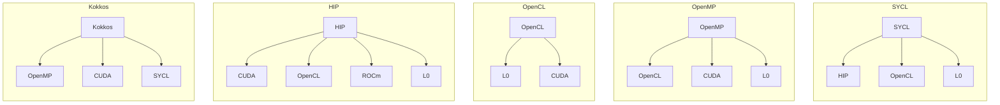
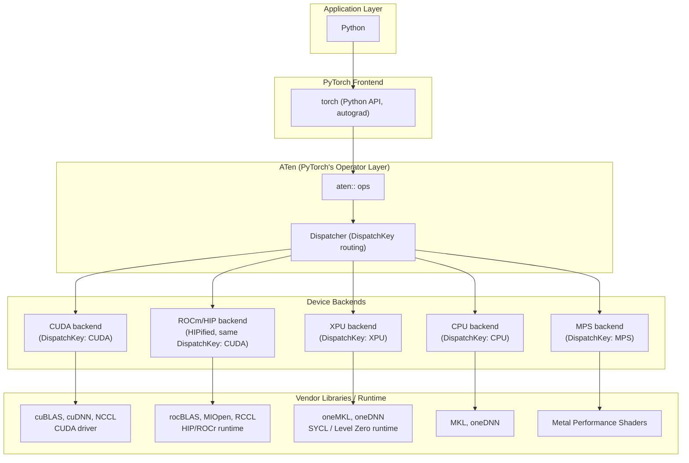

# THAPI/iprof: Tracing Heterogeneous APIs

1. Introduction
2. Features Showcase: No Code Changes, Open Trace Format, Perfetto Native Timeline
3. Programming-Model-Based Tracing
4. Performance Counter Sampling (CXI)
5. Intel ITT Backend
6. Heterogeneous Programming Models: CPU + XPU
7. Heterogeneous Programming Models: CPU + GPU
8. Distributed Computing (MPI)
9. DistributedDataParallel

**References:** [THAPI repository](https://github.com/argonne-lcf/THAPI) ·
[iprof documentation (ALCF Aurora)](https://docs.alcf.anl.gov/aurora/performance-tools/iprof/)

---

### 1. Introduction

THAPI is a generic framework for heterogeneous applications — one tracer,
not one per programming model, that works across the diversity of languages,
programming models, and domain-specific frameworks HPC applications
actually mix:

| Languages | Prospective Languages | Programming Models | Domain-Based Programming Models |
|---|---|---|---|
| <ul><li>FORTRAN</li><li>C</li><li>C++</li><li>**Python**</li></ul> | <ul><li>Julia</li><li>Lua</li><li>PGAS approaches</li></ul> | <ul><li>**MPI**</li><li>OpenMP</li><li>**CUDA**, **L0**, **ROCm**, **HIP**, **OpenCL**</li><li>SYCL, Kokkos, Raja</li></ul> | <ul><li>Linear algebra: BLAS/LAPACK</li><li>FFTs: cuFFT, FFTWx, MKL FFT</li><li>Low-level AI: cuDNN, clDNN, Intel DNNL</li><li>AI/ML: TensorFlow, Caffe, **PyTorch**</li></ul> |

This plethora of alternatives is entwined, especially since heterogeneous
computing is now the norm — the diagram below shows how just the
lower-level programming models alone can be layered on top of one another:

**Diagram 1 — Programming-model interrelation**

PyTorch itself is a microcosm of the same problem: a single Python call
fans out, through ATen's dispatcher, to a different vendor-specific
programming model depending on the device — which is exactly the kind of
heterogeneity a tracer has to handle.

**Diagram 2 — The PyTorch case**

**Supported backends**

| Backend | Description |
|---|---|
| **MPI** | Message Passing Interface — traces point-to-point and collective calls across distributed-memory processes |
| **OpenMP** | Shared-memory parallelism on the host — traces runtime calls (parallel regions, tasks, synchronization) |
| **OpenCL** | Cross-vendor heterogeneous-compute API — traces host-side `cl*` calls (contexts, command queues, kernels) |
| **Level Zero (L0)** | Intel's low-level GPU programming interface — traces host-side `ze*` calls, the backbone of oneAPI/SYCL on Intel GPUs |
| **CUDA** | NVIDIA's GPU programming model — traces both the CUDA runtime and driver APIs |
| **HIP** | AMD's CUDA-portable GPU programming model — traces `hip*` runtime calls on AMD (and, via HIP's own portability, NVIDIA) GPUs |
| **CXI** | HPE Slingshot's low-level network interface — traces host-side fabric/NIC calls, relevant to performance-counter-style sampling (Section 4) |
| **ITT** | Intel's Instrumentation and Tracing Technology — captures named ranges/tasks apps or libraries (e.g. oneDNN) emit for tools like VTune (Section 5) |
| **PyTorch** | Traces `aten::*` ops directly via PyTorch's own RecordFunction hook — no `torch.profiler`/`emit_itt()` wrapping required |

> [!IMPORTANT]
> **Key takeaway** — THAPI/iprof is not a PyTorch-specific or
> vendor-specific tool: it's one tracer whose backends span the whole stack
> this table and both diagrams describe, from the network fabric (CXI) and
> device driver level (Level Zero, CUDA, HIP) up to a specific AI/ML
> framework's own operator dispatch (PyTorch). The rest of this document
> walks through what that buys you in practice, one feature at a time.
