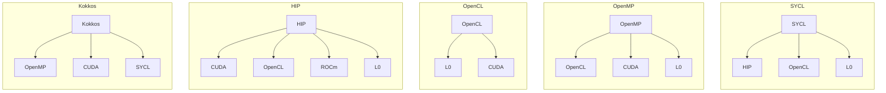
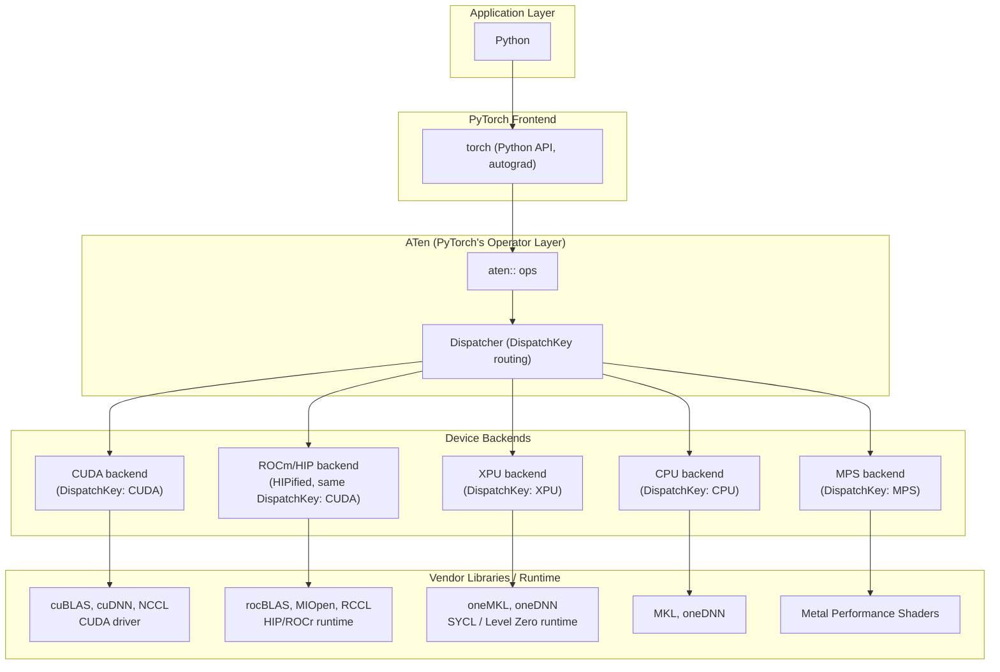

<a href="">

</a>

# THAPI/iprof: Tracing Heterogeneous APIs

1. Introduction
2. Features Showcase
   - No Code Changes, Open Trace Format, Perfetto Native Timeline
   - Programming-Model-Based Tracing
   - Performance Counter Sampling (CXI)
   - Intel ITT Backend
   - Heterogeneous Programming Models: CPU + XPU
   - Heterogeneous Programming Models: CPU + GPU
   - Distributed Computing (MPI)
3. DistributedDataParallel

**References:** [THAPI repository](https://github.com/argonne-lcf/THAPI)

---

### 1. Introduction

THAPI is the tracing infrastructure for heterogeneous computing applications.
`iprof` is the command line tool.

**Usage**

```bash
iprof <executable>
iprof -- python model.py
```

```bash
mpirun iprof -- <executable>
mpirun iprof -- python model.py
```

- THAPI is a generic framework for heterogeneous applications.

| Languages | Prospective Languages | Programming Models | Domain-Based Programming Models |
|---|---|---|---|
| <ul><li>FORTRAN</li><li>C</li><li>C++</li><li>**Python**</li></ul> | <ul><li>Julia</li><li>Lua</li><li>PGAS approaches</li></ul> | <ul><li>**MPI**</li><li>OpenMP</li><li>**CUDA**, **L0**, **ROCm**, **HIP**, **OpenCL**</li><li>SYCL, Kokkos, Raja</li></ul> | <ul><li>Linear algebra: BLAS/LAPACK</li><li>FFTs: cuFFT, FFTWx, MKL FFT</li><li>Low-level AI: cuDNN, clDNN, Intel DNNL</li><li>AI/ML: TensorFlow, Caffe, **PyTorch**</li></ul> |

**Diagram 1: Programming-model interrelation**



- AI/ML workloads are just another, domain-specific case of heterogeneous
  application that THAPI can address. PyTorch itself dispatches to a
  different programming model per device.

**Diagram 2: The PyTorch case**



**Supported backends**

| Backend | Keywords |
|---|---|
| **MPI** | distributed memory, point-to-point, collectives |
| **OpenMP** | shared memory, threads, parallel regions |
| **OpenCL** | cross-vendor, `cl*` calls, command queues |
| **Level Zero (L0)** | Intel GPU, `ze*` calls, oneAPI/SYCL |
| **CUDA** | NVIDIA GPU, runtime + driver API |
| **HIP** | AMD GPU, CUDA-portable, `hip*` calls |
| **CXI** | HPE Slingshot, network fabric, NIC |
| **ITT** | Intel instrumentation, named tasks, VTune |
| **PyTorch** | `aten::*` ops, RecordFunction, no code changes |

---

### 2. Features Showcase

#### 2.1 No Code Changes, Open Trace Format, Perfetto Native Timeline

The base code below is traced as-is. No `with profile(...):`, no
`emit_itt()`, no import added.

```bash
iprof -- python model.py
```

```python
# model.py
import torch
x = torch.randn(2048, 2048, device="xpu")
y = torch.matmul(x, x)
torch.xpu.synchronize()
```

```text
BACKEND_PYTORCH | 1 Hostnames | 1 Processes | 1 Threads |

         Name |    Time | Time(%) | Calls | Average |    Min |     Max |
 aten::matmul | 64.61ms |  47.85% |     1 | 64.61ms | 64.61ms | 64.61ms |
     aten::mm | 64.57ms |  47.83% |     1 | 64.57ms | 64.57ms | 64.57ms |
...

BACKEND_OPENCL,BACKEND_ZE | 1 Hostnames | 1 Processes | 1 Threads |

                          Name |    Time | Time(%) | Calls | Average |    Min |     Max |
   zeContextMakeMemoryResident | 7.13ms |  38.00% |   324 | 21.99us | 5.88us | 324.15us |
         zeDeviceCanAccessPeer | 3.16ms |  16.86% |   132 | 23.96us |  171ns |  70.67us |
...

Device profiling | 1 Hostnames | 1 Processes | 1 Threads | 1 Devices | 1 Subdevices |

                                                                      Name |    Time | Time(%) | Calls |  Average |
                                                               gemm_kernel | 817.60us |  93.85% |     1 | 817.60us |
at::native::xpu::DistributionElementw[...]alTransformFunctor<float, float>, int> | 41.92us | 4.81% | 1 | 41.92us |
...
```

📄 [Full tally](02_1_no_code_changes/iprof_summary.txt) ·
[Raw trace](02_1_no_code_changes/raw_trace.txt) ·
[Intervals](02_1_no_code_changes/intervals.txt) ·
[Aggregations](02_1_no_code_changes/aggregations.txt)

🔗 [Explore this trace in Perfetto](https://ui.perfetto.dev/#!/?url=https://raw.githubusercontent.com/DonAurelio/notes/main/slides/2026_iprof_showcase/02_1_no_code_changes/iprof_timeline.pftrace)
