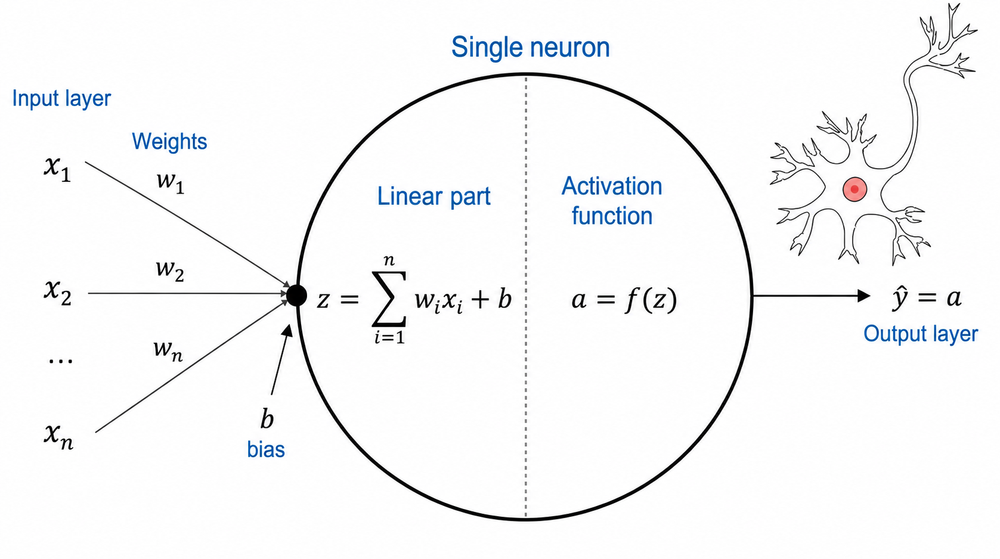
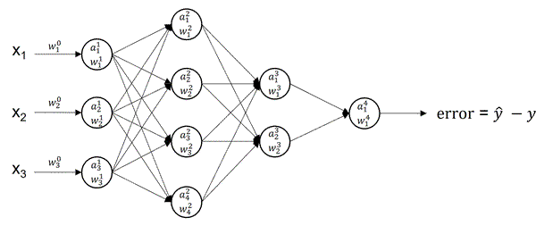
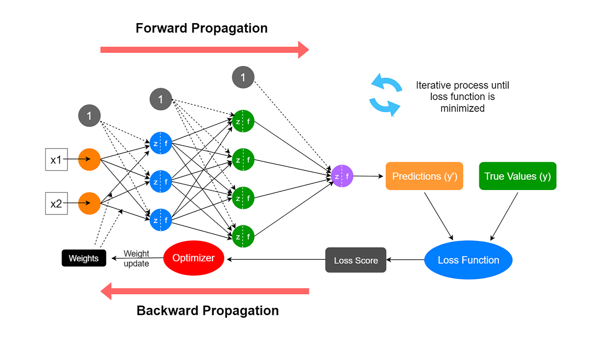

# PyTorch 

* PyTorch is an open-source machine learning and deep learning framework used primarily for building, training, and deploying **neural networks**.
* Neural networks (NNs) are a collection of nested functions that are executed on some input data.
* These functions are defined by parameters, e.g., weights and biases.
* Input/output data and parameters are **tensors**.
* Training a NN happens in two steps:

    - Forward Propagation (**predict**): In forward prop, the NN makes its best guess about the correct output. It runs the input data through each of its functions to make this guess.

    - Backward Propagation (**learn**): In backprop, the NN adjusts its parameters (weights) proportionate to the error in its guess. It does this by traversing backwards from the output, collecting the derivatives of the error with respect to the parameters of the functions (gradients), and optimizing the parameters using gradient descent. For a more detailed walkthrough of backprop, check out this video from [3Blue1Brown](https://www.youtube.com/watch?v=tIeHLnjs5U8).

**Figure 1.** Perceptron

**Animation 1.** Forward (predict) and Backward (learn)

**Figure 2.** Forward (predict) and Backward (learn)

# References

1. [Deep Learning with PyTorch: A 60 Minute Blitz](https://docs.pytorch.org/tutorials/beginner/deep_learning_60min_blitz.html)
2. [Deep Learning Simplified: Feel and Talk like an Expert in Neural Networks](https://pub.towardsai.net/deep-learning-simplified-feel-and-talk-like-an-expert-in-neural-networks-911dce0765e9)
3. [Understanding Forward and Backward Propagation in Neural Networks](https://www.linkedin.com/pulse/understanding-forward-backward-propagation-neural-suresh-beekhani-e0rkf/)

