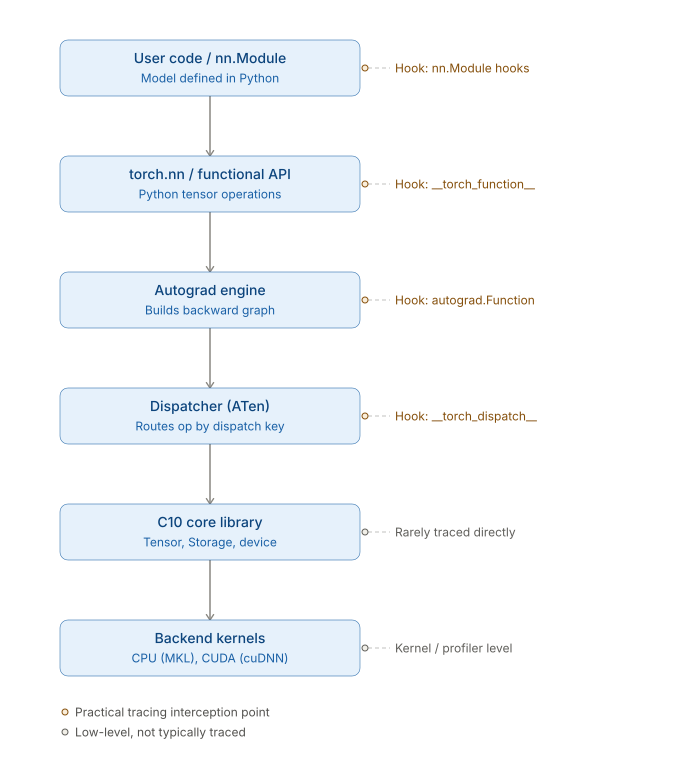
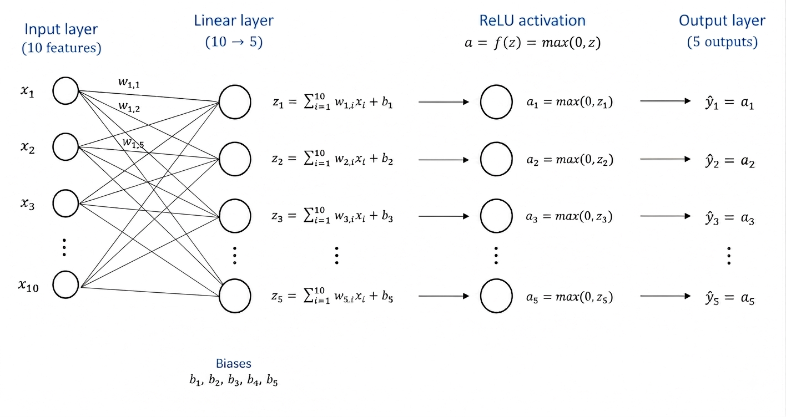

# PyTorch: Architecture



___

### User code / torch.nn

* Neural networks can be constructed using the `torch.nn` package.
* While raw PyTorch tensors and autograd provide the mathematical backend, `torch.nn` acts as a high-level abstraction layer that encapsulates data state, learnable weights, and common architectural patterns.
* `torch.nn.Module` is the fundamental base class used to build and organize all neural network models and layers.
* An `nn.Module` contains layers, and a method `forward(input)` that returns the `output`.
* A typical training procedure for a neural network is as follows:
    - Define the neural network that has some learnable parameters (or weights)
    - Iterate over a dataset of inputs
    - Process input through the network
    - Compute the loss (how far is the output from being correct)
    - Propagate gradients back into the network’s parameters
    - Update the weights of the network, typically using a simple update rule: `weight = weight - learning_rate * gradient`

___

**Code 1** is a simple feed-forward network (see **Figure 1**). It takes the input, feeds it through several layers (one in this case) one after the other, and then finally gives the output.

**Code 1.** Single-Layer Feedforward Network

```python
import torch
import torch.nn as nn

class MyModel(nn.Module):
    def __init__(self):
        """ Define the layers """ 
        super().__init__()
        # an affine operation: y = Wx + b
        self.linear = nn.Linear(10, 5)

    def forward(self, x):
        """ Connect the layers """ 
        return torch.relu(self.linear(x))

model = MyModel()

print(model)
```

**Figure 1.** Single-Layer Feedforward Network



___

### Functional API / torch.nn.functional

* `torch.nn.functional` namespace provides stateless, purely functional interfaces for neural network operations.
* Conventionally imported as import `torch.nn.functional as F`.
* This namespace contains all the functions in the `torch.nn` library (whereas other parts of the library contain classes).
* It contains functions for activations, pooling, convolutions, and losses. 
* Unlike `torch.nn` modules which are Object-Oriented and manage their own internal states (like weights and biases), functions in `torch.nn.functional` do not hold or manage parameters automatically.

NOTE: A neural network is essentially a composition of nested functions (layers), each with its own parameters (weights and biases), that feed an input forward to produce an output. Parameters, inputs, and outputs are all represented as **tensors**.

__Comparative example: `torch.nn` vs `torch.nn.functional`__

```python
import torch
import torch.nn as nn
import torch.nn.functional as F

# ----- Using torch.nn (Object-Oriented) -----
# The Linear module owns and stores its weight and bias internally.
linear_layer = nn.Linear(in_features=4, out_features=2)

x = torch.randn(1, 4)
output_oo = linear_layer(x)   # weight & bias are managed internally

print(linear_layer.weight.shape)  # torch.Size([2, 4])
print(linear_layer.bias.shape)    # torch.Size([2])


# ----- Using torch.nn.functional (Functional) -----
# No internal state. You must supply weight and bias explicitly every call.
weight = torch.randn(2, 4)
bias = torch.randn(2)

output_func = F.linear(x, weight, bias)  # stateless: params passed in directly
```

__Key difference illustrated:__
- `nn.Linear` is a **module** (a class instance) — once created, it *holds* `weight` and `bias` as internal parameters (`nn.Parameter` tensors), and you just call it like a function on subsequent inputs (`linear_layer(x)`).
- `F.linear` is a **pure function** — it has no memory of any weight or bias. You must pass the tensors in explicitly on every call, and nothing is stored between calls.

This is exactly why `nn.Linear` (and other `torch.nn` modules) are typically implemented *using* their functional counterparts under the hood — the module's `forward()` method just calls `F.linear(input, self.weight, self.bias)`, wrapping the stateless function with stateful parameter storage.

# References

1. [What is torch.nn really?](https://docs.pytorch.org/tutorials/beginner/nn_tutorial.html#what-is-torch-nn-really)
2. [Neural Networks](https://docs.pytorch.org/tutorials/beginner/blitz/neural_networks_tutorial.html)
3. [Understanding ATen: PyTorch's tensor library](https://developers.redhat.com/articles/2026/02/19/understanding-aten-pytorchs-tensor-library#)
    - [The PyTorch architecture stack](https://developers.redhat.com/articles/2026/02/19/understanding-aten-pytorchs-tensor-library#the_pytorch_architecture_stack)
    - [What is ATen?](https://developers.redhat.com/articles/2026/02/19/understanding-aten-pytorchs-tensor-library#what_is_aten_)
    -  [The dispatch system](https://developers.redhat.com/articles/2026/02/19/understanding-aten-pytorchs-tensor-library#core_architecture_components)