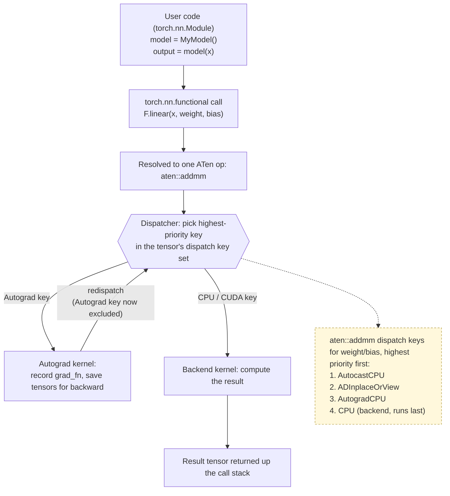
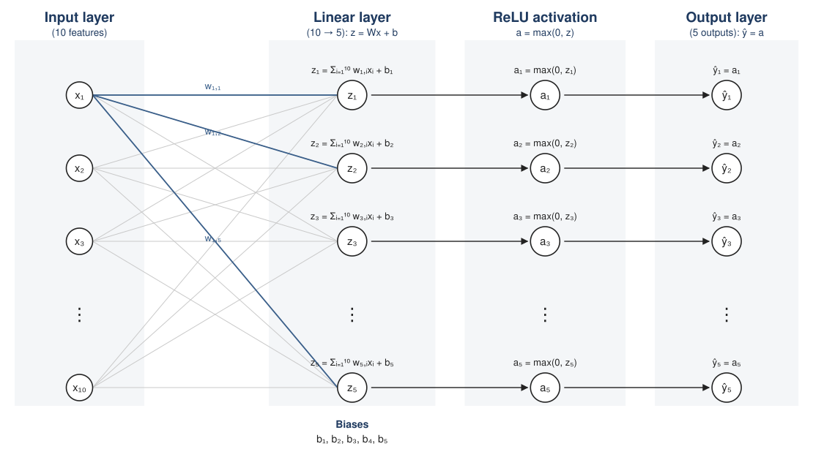

# PyTorch: Architecture

### Overview: from Python call to computed result

* This overview and Figure 1 are based on **Code 1**, below — the `MyModel` class and its `model(x)` call.
* When Python code calls a tensor operation — directly (e.g. `x + y`), or through a `torch.nn` layer (e.g. `model(x)`) — that call does not go straight to a CPU or GPU kernel. It passes through several layers first.
* Calling a model, e.g. `model(x)`, triggers that model's `forward()` method, which issues its own sequence of tensor-op calls — one `model(x)` call is really a chain of smaller calls (e.g. `self.linear(x)`, then `torch.relu(...)`), each of which goes through the same process described below.
* Each of those calls resolves to a single, low-level operation in ATen's flat operator namespace — a high-level call like `F.linear(x, w, b)` resolves to `aten::linear` (or, as shown in Figure 1, `aten::addmm`).
* Every tensor carries a **dispatch key set** — a small set of tags describing things like its device (`CPU`, `CUDA`) and whether it needs gradient tracking (`Autograd`). An op like `aten::addmm` takes several tensors (`x`, `weight`, `bias`), so the dispatcher works from the **union** of all their key sets, not just one tensor's.
* The **ATen dispatcher** looks at that op and that combined key set, and runs the kernel registered for the **highest-priority key present**. If any input tensor has `requires_grad=True`, that key is `Autograd`, not `CPU`.
* Crucially, the `Autograd` kernel does not compute the result itself. It records what is needed for the backward pass (building a `grad_fn` node), and then **redispatches** — it re-enters the dispatcher, this time excluding the keys already handled, so the next key in line (`CPU`) gets its turn and actually computes the result.
* So dispatching is not a one-way trip down a stack of layers — it is a single call that can loop through the dispatcher more than once, one key at a time, before a backend kernel finally produces a value.

**Figure 1** shows this redispatch loop for one operation call.

**Figure 1.** One ATen op call, dispatched through the Autograd key, then redispatched to the CPU key



* Each box in Figure 1 is expanded into its own section below: `torch.nn`/functional API first, then the ATen dispatcher — including Autograd, which is one of its dispatch keys, not a separate stage — then the C10 data structures it operates on, and finally the backend kernels that produce the final result.

___

### User code / torch.nn

* Neural networks can be constructed using the `torch.nn` package.
* While raw PyTorch tensors and autograd provide the mathematical backend, `torch.nn` acts as a high-level abstraction layer that encapsulates data state, learnable weights, and common architectural patterns.
* `torch.nn.Module` is the fundamental base class used to build and organize all neural network models and layers.
* An `nn.Module` contains layers, and a method `forward(input)` that returns the `output`.

___

**Code 1** is a simple feed-forward network (see **Figure 2**). It takes the input, feeds it through several layers (one in this case) one after the other, and then finally gives the output.

**Code 1.** Single-Layer Feedforward Network

```python
import torch
import torch.nn as nn

class MyModel(nn.Module):
    def __init__(self):
        """ Define the layers """ 
        super().__init__()
        # an affine operation: y = Wx + b
        self.linear = nn.Linear(10, 5)

    def forward(self, x):
        """ Connect the layers """ 
        return torch.relu(self.linear(x))

torch.manual_seed(0)
model = MyModel()
print(model)

x = torch.randn(1, 10)
output = model(x)
print("output:", output)
print("output.grad_fn:", output.grad_fn)
```

**Output**

```
MyModel(
  (linear): Linear(in_features=10, out_features=5, bias=True)
)
output: tensor([[0.0000, 0.5173, 0.2658, 0.0000, 0.7478]], grad_fn=<ReluBackward0>)
output.grad_fn: <ReluBackward0 object at 0x1089db940>
```

`model(x)` is the call Figure 1 depicts as "User code". Note that `output.grad_fn` is already `ReluBackward0` — not `Relu`, but its Autograd node — a first hint of the Autograd section coming up below. It also means `model(x)` is not one single ATen operation: it's `self.linear(x)` (a `nn.Linear`, wrapping `F.linear` — see the next section) *followed by* `torch.relu(...)`. Figure 1's "one ATen op" box therefore repeats once per op in that sequence; the ATen section further down unpacks exactly which ops `model(x)` breaks down into.

**Figure 2.** Single-Layer Feedforward Network



Figure 2 draws out exactly what Code 1's `self.linear` and `torch.relu` compute: the weights (`w`) and biases (`b`) are the network's learnable parameters (`nn.Linear`'s internal state), and the arrows from input to output are one forward pass — `z = Σ w·x + b`, then `a = max(0, z)`. That "process input through the network" step is one part of a typical training procedure for a neural network:

- Define the neural network that has some learnable parameters (or weights) ← the `w`/`b` in Figure 2, created by `nn.Linear(10, 5)`
- Iterate over a dataset of inputs
- **Process input through the network** ← Code 1's `model(x)`, visualized in Figure 2
- Compute the loss (how far is the output from being correct)
- **Propagate gradients back into the network's parameters** ← covered in the Autograd section below
- Update the weights of the network, typically using a simple update rule: `weight = weight - learning_rate * gradient`

This note focuses on what happens *during* the forward step — the dispatcher, dispatch keys, and backend kernels covered from here on all run underneath a single call like `model(x)`. The backward step is picked up conceptually in the Autograd section, but training loops and optimizers are outside this note's scope.

___

### Functional API / torch.nn.functional

* `torch.nn.functional` namespace provides stateless, purely functional interfaces for neural network operations.
* Conventionally imported as import `torch.nn.functional as F`.
* This namespace contains all the functions in the `torch.nn` library (whereas other parts of the library contain classes).
* It contains functions for activations, pooling, convolutions, and losses. 
* Unlike `torch.nn` modules which are Object-Oriented and manage their own internal states (like weights and biases), functions in `torch.nn.functional` do not hold or manage parameters automatically.

NOTE: A neural network is essentially a composition of nested functions (layers), each with its own parameters (weights and biases), that feed an input forward to produce an output. Parameters, inputs, and outputs are all represented as **tensors**.

__Comparative example: `torch.nn` vs `torch.nn.functional`__

```python
import torch
import torch.nn as nn
import torch.nn.functional as F

# ----- Using torch.nn (Object-Oriented) -----
# The Linear module owns and stores its weight and bias internally.
linear_layer = nn.Linear(in_features=4, out_features=2)

x = torch.randn(1, 4)
output_oo = linear_layer(x)   # weight & bias are managed internally

print(linear_layer.weight.shape)  # torch.Size([2, 4])
print(linear_layer.bias.shape)    # torch.Size([2])


# ----- Using torch.nn.functional (Functional) -----
# No internal state. You must supply weight and bias explicitly every call.
weight = torch.randn(2, 4)
bias = torch.randn(2)

output_func = F.linear(x, weight, bias)  # stateless: params passed in directly
```

__Key difference illustrated:__
- `nn.Linear` is a **module** (a class instance) — once created, it *holds* `weight` and `bias` as internal parameters (`nn.Parameter` tensors), and you just call it like a function on subsequent inputs (`linear_layer(x)`).
- `F.linear` is a **pure function** — it has no memory of any weight or bias. You must pass the tensors in explicitly on every call, and nothing is stored between calls.

This is exactly why `nn.Linear` (and other `torch.nn` modules) are typically implemented *using* their functional counterparts under the hood — the module's `forward()` method just calls `F.linear(input, self.weight, self.bias)`, wrapping the stateless function with stateful parameter storage.

___

### Autograd: building the backward graph

* Every tensor created with `requires_grad=True`, or produced by an operation on such a tensor, can carry a **backward graph** — a record of how it was computed, used later to compute gradients.
* This graph is **not** written down ahead of time. It is built dynamically, one node at a time, as each operation actually runs. PyTorch calls this "define-by-run": the graph only exists for the specific sequence of operations that was executed.
* A tensor's `.grad_fn` attribute points to the node representing the last operation that produced it.
    - A **leaf** tensor (one you created directly, e.g. with `torch.randn(...)`) has `grad_fn = None` — nothing created it, so there's nothing to record.
    - Any tensor produced by an operation has a `grad_fn` naming that operation, e.g. `MulBackward0` for a multiplication.
* Each `grad_fn` node links back to the `grad_fn` of whatever tensors fed into that operation, via `.next_functions`. Following these links backward from the final output traces the entire computation, step by step, in reverse.
* Calling `.backward()` on a tensor walks this graph backward from that tensor, computing gradients along the way and accumulating them into the `.grad` attribute of every leaf tensor with `requires_grad=True`.

**Code 2** builds a two-step computation and inspects the resulting graph before and after calling `.backward()`.

**Code 2.** Inspecting the autograd graph

```python
import torch

torch.manual_seed(0)
x = torch.randn(3, requires_grad=True)
y = x * 2
z = y.sum()

print("x:", x)
print("x.grad_fn:", x.grad_fn)
print("y.grad_fn:", y.grad_fn)
print("z.grad_fn:", z.grad_fn)
print("z.grad_fn.next_functions:", z.grad_fn.next_functions)

z.backward()
print("x.grad:", x.grad)
```

**Output**

```
x: tensor([ 1.5410, -0.2934, -2.1788], requires_grad=True)
x.grad_fn: None
y.grad_fn: <MulBackward0 object at 0x10fd36680>
z.grad_fn: <SumBackward0 object at 0x10fd36560>
z.grad_fn.next_functions: ((<MulBackward0 object at 0x10fd36680>, 0),)
x.grad: tensor([2., 2., 2.])
```

`x` is a leaf, so `x.grad_fn` is `None`. `y = x * 2` has `grad_fn = MulBackward0`, and `z = y.sum()` has `grad_fn = SumBackward0`, whose `next_functions` points back to the `MulBackward0` node that produced `y` — that link is the graph. `z.backward()` walks that chain in reverse and deposits the gradient of `z` with respect to `x` into `x.grad`.

Note: nothing here mentions CPU, CUDA, or a dispatcher yet — the backward graph is a bookkeeping concept that sits on top of whichever backend actually computed the forward values. The next sections connect this bookkeeping to *how* it gets triggered on every single operation.

___

### ATen: one flat namespace, one op per call

* ATen ("A Tensor library") is PyTorch's core tensor library — it defines the actual tensor operations (`add`, `linear`, `matmul`, `relu`, ...) as a flat set of named operators, independent of any Python API sugar.
* No matter which "front door" you use in Python — an operator (`a + b`), a function (`torch.add(a, b)`), or a `torch.nn.functional` call — they all resolve to a single call into this same namespace, exposed in Python as `torch.ops.aten.*`.
* This is exactly why ATen is a good place to observe "every tensor operation": however varied the Python-level entry points are, they collapse into one uniform, well-defined operator per computation.

**Code 3** shows three different Python spellings of the same addition all resolving to the identical ATen operator.

**Code 3.** Three ways to call the same ATen op

```python
import torch

torch.manual_seed(0)
a = torch.randn(3)
b = torch.randn(3)

r1 = torch.add(a, b)
r2 = a + b
r3 = torch.ops.aten.add.Tensor(a, b)

print("torch.add(a, b):                ", r1)
print("a + b:                          ", r2)
print("torch.ops.aten.add.Tensor(a, b):", r3)
print("all equal:", torch.equal(r1, r2) and torch.equal(r2, r3))

print()
print("resolved op:", torch.ops.aten.add.Tensor)
print("overload name:", torch.ops.aten.add.Tensor._schema)
```

**Output**

```
torch.add(a, b):                 tensor([ 2.1094, -1.3780, -3.5774])
a + b:                           tensor([ 2.1094, -1.3780, -3.5774])
torch.ops.aten.add.Tensor(a, b): tensor([ 2.1094, -1.3780, -3.5774])
all equal: True

resolved op: aten.add.Tensor
overload name: aten::add.Tensor(Tensor self, Tensor other, *, Scalar alpha=1) -> Tensor
```

`torch.add`, the `+` operator, and the explicit `torch.ops.aten.add.Tensor` call all reach the exact same operator, `aten::add.Tensor`, with the same schema (its typed argument/return signature). Whatever Python spelling triggered it, from here on it's just "one ATen op call" — which is what gets handed to the dispatcher next.

___

### Dispatch keys and the redispatch loop

* An ATen op like `aten::add.Tensor` is not implemented by a single function. It can have a *different* kernel registered for each **dispatch key** — `CPU`, `CUDA`, `MPS`, `Autograd`, and others.
* Every tensor carries a **dispatch key set**: a small collection of tags describing that tensor's device and state (e.g. whether it needs gradient tracking).
* When an op is called, the **dispatcher** looks at the key set of the tensors involved and picks the kernel registered for the **highest-priority key present**. `Autograd` outranks `CPU`, so a CPU tensor with `requires_grad=True` runs its `Autograd` kernel first — not its `CPU` kernel.
* The `Autograd` kernel's job is bookkeeping, not computation: it builds the `grad_fn` node from the Autograd section above, decides what needs to be saved for backward, and then **redispatches** — it calls back into the dispatcher for the same op, but with the `Autograd` key now excluded from consideration. That lets the next-highest key (`CPU`) take its turn and actually compute the result.
* This is the mechanism behind Figure 1 at the top of this note: one Python-level call can trigger the dispatcher more than once for the same op, walking down the key set one key at a time, before a backend kernel finally runs.

**Code 4** first dumps the dispatcher's registration table for `add.Tensor`, showing there really is one kernel per key. It then makes the redispatch loop directly observable: forcing the dispatcher to skip the `Autograd` key changes whether a `grad_fn` gets built at all, even though the numeric result is identical either way.

**Code 4.** Dispatch keys and manually skipping one

```python
import torch

torch.manual_seed(0)
x = torch.randn(3, requires_grad=True)
y = torch.randn(3, requires_grad=True)

print("dispatch key set on x:", torch._C._dispatch_key_set(x))
print()

# Normal call: dispatcher picks the highest-priority key (Autograd) first.
# Its kernel records a grad_fn, then redispatches so CPU's kernel does the math.
z_normal = torch.ops.aten.add.Tensor(x, y)
print("normal call        -> grad_fn:", z_normal.grad_fn)

# Manually exclude the Autograd key: the dispatcher skips straight to CPU.
with torch._C._ExcludeDispatchKeyGuard(torch._C.DispatchKeySet(torch._C.DispatchKey.AutogradCPU)):
    z_excluded = torch.ops.aten.add.Tensor(x, y)
print("Autograd excluded  -> grad_fn:", z_excluded.grad_fn)

print()
print("same numeric result either way:", torch.equal(z_normal, z_excluded))
```

**Output**

```
dispatch key set on x: DispatchKeySet(CPU, ADInplaceOrView, AutogradCPU, AutocastCPU)

normal call        -> grad_fn: <AddBackward0 object at 0x10d47f4c0>
Autograd excluded  -> grad_fn: None

same numeric result either way: True
```

Looking up `torch._C._dispatch_dump("aten::add.Tensor")` confirms there is indeed a separate registration per key, including these two:

```
CPU: registered at .../RegisterCPU_0.cpp:1297 :: (Tensor _0, Tensor _1, Scalar _2) -> Tensor _0
Autograd[alias]: registered at .../VariableType_2.cpp:10455 :: (Tensor _0, Tensor _1, Scalar _2) -> Tensor _0
```

Normally, the `Autograd` key wins dispatch priority, its kernel records a `grad_fn`, and it redispatches to `CPU` for the actual math — that's the "normal call" row above. Forcibly excluding `Autograd` from the tensors' key set makes the dispatcher hand the very same call straight to the `CPU` kernel instead: the math comes out identical, but no `grad_fn` is ever built, because the bookkeeping kernel never ran. This is direct, observable proof that "Autograd" and "the ATen dispatcher" are not two separate layers one calls into the other — they are two turns of the *same* dispatch loop.

___

### C10 core library

* C10 ("Caffe2 and ATen, version 10") is the core library beneath ATen. It defines the fundamental data structures that every layer above operates on: `Tensor`, `Storage` (the actual memory buffer backing a tensor), `Device`, `Dtype`, and the dispatch key set itself.
* This layer is rarely traced directly — it doesn't run operations, it defines *what a tensor is*. But its structures are exactly what the dispatcher inspects (the dispatch key set) and what a backend kernel reads and writes (the storage buffer), so it's worth being able to see them concretely.

**Code 5** reads several C10-level attributes directly off a tensor, including the same dispatch key set introspected in Code 4.

**Code 5.** Inspecting a tensor's C10-level structure

```python
import torch

torch.manual_seed(0)
t = torch.randn(2, 3, requires_grad=True)

print("dtype:   ", t.dtype)
print("device:  ", t.device)
print("shape:   ", t.shape)
print("stride:  ", t.stride())
print("storage type:        ", type(t.untyped_storage()))
print("storage size (bytes):", t.untyped_storage().nbytes())
print("storage device:      ", t.untyped_storage().device)
print("dispatch key set:    ", torch._C._dispatch_key_set(t))
```

**Output**

```
dtype:    torch.float32
device:   cpu
shape:    torch.Size([2, 3])
stride:   (3, 1)
storage type:         <class 'torch.storage.UntypedStorage'>
storage size (bytes): 24
storage device:       cpu
dispatch key set:     DispatchKeySet(CPU, ADInplaceOrView, AutogradCPU, AutocastCPU)
```

`dtype`, `device`, `shape`, and `stride` describe how to interpret the raw bytes in `storage` as a 2×3 grid of 32-bit floats (2 × 3 × 4 bytes = 24 bytes, matching `nbytes()`). The `dispatch key set` is the same C10 structure the dispatcher read in Code 4 to decide which kernel runs first.

___

### Backend kernels

* Once the dispatcher has walked down to a backend key like `CPU` or `CUDA`, the registered kernel for that key is what actually performs the computation, by calling into an optimized numerical library.
* On CPU, this typically means calling into libraries like MKL, oneDNN, or NNPACK for things like matrix multiplication and convolutions. On CUDA, the equivalent role is played by cuDNN and cuBLAS.
* This is the lowest level in the stack, and per Figure 1's mermaid diagram, it's the endpoint of a redispatch chain rather than something a tracer usually hooks directly — by the time execution reaches here, the op has already been fully identified and dispatched. Tools that do need this level of visibility (e.g. measuring how long a specific CUDA kernel took) typically use `torch.profiler` rather than intercepting the dispatcher itself.

# References

1. [What is torch.nn really?](https://docs.pytorch.org/tutorials/beginner/nn_tutorial.html#what-is-torch-nn-really)
2. [Neural Networks](https://docs.pytorch.org/tutorials/beginner/blitz/neural_networks_tutorial.html)
3. [Understanding ATen: PyTorch's tensor library](https://developers.redhat.com/articles/2026/02/19/understanding-aten-pytorchs-tensor-library#)
    - [The PyTorch architecture stack](https://developers.redhat.com/articles/2026/02/19/understanding-aten-pytorchs-tensor-library#the_pytorch_architecture_stack)
    - [What is ATen?](https://developers.redhat.com/articles/2026/02/19/understanding-aten-pytorchs-tensor-library#what_is_aten_)
    -  [The dispatch system](https://developers.redhat.com/articles/2026/02/19/understanding-aten-pytorchs-tensor-library#core_architecture_components)
4. [Let's talk about the PyTorch dispatcher](http://blog.ezyang.com/2020/09/lets-talk-about-the-pytorch-dispatcher/) — the design behind dispatch keys and redispatching
5. [PyTorch internals](http://blog.ezyang.com/2019/05/pytorch-internals/) — overview of Tensor, Storage, and the C10 core structures
6. [Autograd mechanics](https://docs.pytorch.org/docs/stable/notes/autograd.html) — how the backward graph is built and walked
7. `torch/csrc/autograd/generated/VariableType_*.cpp` and `aten/src/ATen/core/dispatch/Dispatcher.h` in the [PyTorch source](https://github.com/pytorch/pytorch) — where the Autograd kernel's record-then-redispatch behavior is generated and where the dispatcher's key-priority lookup lives